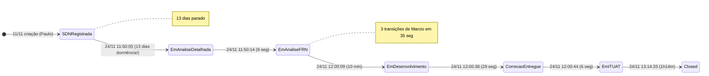

Extract Bug 1184452 full data

Read [](file:///c%3A/Users/yfranconeri/Source/persona-agents/samples/02-telecom/iniciativa1/WorkItem-Bug-1184452.json)

Read [](file:///c%3A/Users/yfranconeri/Source/persona-agents/samples/02-telecom/iniciativa1/WorkItem-Bug-1184452-Revisoes.json#1-1), lines 1 to 500

Read [](file:///c%3A/Users/yfranconeri/Source/persona-agents/samples/02-telecom/iniciativa1/WorkItem-Bug-Updates-1184452.json#1-1), lines 1 to 500

Read [](file:///c%3A/Users/yfranconeri/Source/persona-agents/samples/02-telecom/iniciativa1/WorkItem-Bug-Updates-1184452.json#501-501), lines 501 to 2000

Read [](file:///c%3A/Users/yfranconeri/Source/persona-agents/samples/02-telecom/iniciativa1/WorkItem-Bug-1184452-Revisoes.json#501-501), lines 501 to 2000

Read [](file:///c%3A/Users/yfranconeri/Source/persona-agents/samples/02-telecom/iniciativa1/WorkItem-Bug-Updates-1184452.json#2001-2001), lines 2001 to 2029

Read [](file:///c%3A/Users/yfranconeri/AppData/Roaming/Code/User/workspaceStorage/a8b35945cd3dd31e5d7d53469e8cec63/GitHub.copilot-chat/chat-session-resources/66d2c66e-3df1-46c5-b39b-22cc3d3cf02a/toolu_vrtx_01HKLVSEHME1RvRqmbU4KFzq__vscode-1776105701718/content.txt)

Excelente, tenho todos os dados. Aqui está a análise completa:

---

# Análise de Ciclo de Vida — Bug #1184452

---

## 1. Ficha Técnica

| Campo | Valor |
|-------|-------|
| **ID** | 1184452 |
| **Tipo** | Bug |
| **Título** | Alteração da Fraseologia e Criação do Botão - inFlight - Copy - Copy |
| **Projeto** | Projeto_Service_Creation |
| **AreaPath** | Projeto_Service_Creation\Waterfall |
| **Estado final** | Closed |
| **Reason** | Moved out of state Em IT/UAT |
| **Criado** | 2025-11-11 11:54:36 |
| **Closed** | 2025-11-24 13:14:33 |
| **Criado por** | Paulo Ricardo Castellanos Souza |
| **ActivatedDate** | 2025-11-24 11:50:05 |
| **ActivatedBy** | Paulo Ricardo Castellanos Souza |
| **ResolvedDate** | 2025-11-24 12:00:38 |
| **ResolvedBy** | Marcio Evaristo Souza |
| **ClosedDate** | 2025-11-24 13:14:33 |
| **ClosedBy** | Anderson Teixeira Abrantes |
| **Última alteração** | 2025-12-11 13:58:31 |
| **ChangedBy (final)** | Victor Rodrigues Da Silva |
| **Revisões** | 20 |
| **Updates** | 23 |
| **Comentários** | 2 |
| **Origem** | Copied from #1136722 (IT Task) |

---

## 2. Campos Customizados

| Campo | Valor |
|-------|-------|
| **CodigoDemanda.TIMDM** | 251078031 |
| **CodigoFQA.TIMDM** | TR1164264 (originalmente "Teste unitario" — corrigido na rev 5) |
| **TestCaseLinkCount.TIMDM** | 3 |
| **StoryPoints** | 1 |
| **Priority** | 2 |
| **Severity** | 2 - High |
| **ValueArea** | Business |
| **BugOrigenSDN.TIMDM** | FQA |
| **BugProject.TIMDM** | VAS |
| **BugSubProject.TIMDM** | VAS |
| **BugOrigin.TIMDM** | TI CCC |
| **BugEnviroment.TIMDM** | IT / UAT |
| **BugTipoDeErro.TIMDM** | Codificação - System Test |
| **BugVendor.TIMDM** | ENGINEERING |
| **Custom.VendorGroup** | Engineering - VAS |
| **Custom.KPIProdutividade** | FQA - Atos (originalmente ".Não Designado") |
| **Custom.MotivoFechamento** | Corrigido |
| **Custom.ExpurgoVendorRating** | Não |
| **CausaRaiz.TIMDM** | DEPLOY / KIT |
| **CausaRaizN2.TIMDM** | DEPLOY / KIT - CHANGE FORM - FALHA NA DEFINIÇÃO DOS PARÂMETROS DA DOCUMENTAÇÃO DA CHANGE |
| **EstimatedResolutionDate.TIMDM** | 2025-11-25 12:00:00 |
| **StatusAuxiliar.TIMDM** | Fechado |
| **ResponsavelDePara.TIMDM** | FECHADA |
| **AuxiliarDeParaBug.TIMDM** | FQA |
| **TesteCase.Liberado.TIMDM** | Sim |

### Métricas de Reteste (preenchidas no fechamento)

| Campo | Valor |
|-------|-------|
| **QtdMinPerdidosReteste.TIMDM** | 120 (2 horas declaradas) |
| **QtdCenariosReteste.TIMDM** | 3 |
| **SistemaAreaReteste.TIMDM** | APP_MeuTim |
| **MotivoReteste.TIMDM** | ENTREGA DE KIT |
| **CreatedByReteste.TIMDM** | Anderson Teixeira Abrantes |
| **RetesteComputadoAuxiliar.TIMDM** | false (foi true brevemente na rev 17-18, revertido pela automação) |

### Descrição do Defeito (ReproSteps)

> Após a execução do reset de senha não está retornando para a aplicação de origem.
> Ao clicar em voltar para o aplicativo a aplicação não está retornando.

Com 2 screenshots inline como evidência.

---

## 3. Hierarquia e Relações

```
┌──────────────────────────────────────────────────────────────────┐
│  PROJETO: Projeto_Service_Creation                               │
│                                                                  │
│  Bug #1184452 ◄ ESTE                                             │
│    ├── Child #1188548 (Entrega bug — Aprovada em FQA)       │
│    ├── Child #1192780 (Entrega bug — Aprovada em FQA)       │
│    └── Child #1199583 (Reteste — adicionado pela automação)      │
│                                                                  │
│  IT Task #1136722 (Portfolio Tim TI) ── Related ── Bug #1184452  │
│    (Copied from — mencionado no comentário de criação)           │
│                                                                  │
│  TC #1171260 (CY0001) ── TestedBy ── Bug #1184452               │
│  TC #1171261 (CY0002) ── TestedBy ── Bug #1184452               │
│  TC #1171262 (CY0003) ── TestedBy ── Bug #1184452               │
│                                                                  │
└──────────────────────────────────────────────────────────────────┘
```

| # | Tipo de Relação | Destino | Nome |
|---|----------------|---------|------|
| 1 | Hierarchy-Forward | #1188548 | Child |
| 2 | Hierarchy-Forward | #1192780 | Child |
| 3 | Hierarchy-Forward | #1199583 (Reteste) | Child |
| 4 | System.LinkTypes.Related | #1136722 (IT Task) | Related |
| 5 | TestedBy-Forward | TC #1171260 (CY0001) | Tested By |
| 6 | TestedBy-Forward | TC #1171261 (CY0002) | Tested By |
| 7 | TestedBy-Forward | TC #1171262 (CY0003) | Tested By |

> **7 relações** — o Bug é o WI mais interconectado da iniciativa. Concentra 3 TCs, 3 Children (incluindo o Reteste #1199583) e 1 link ao IT Task de origem.

---

## 4. Atores

| # | Nome | E-mail | Papéis |
|---|------|--------|--------|
| 1 | Paulo Ricardo Castellanos Souza | pcsouza@timbrasil.com.br | Criador, AssignedTo, BugSubmitter, BugOwnerCCC, ActivatedBy |
| 2 | AzDevOpsServ_PRD | AzDevOpsServ_PRD_usr@timbrasil.com.br | Automação (sync de campos, ResponsavelDePara, CausaRaiz) |
| 3 | Anderson Teixeira Abrantes | aabrantes_atos@timbrasil.com.br | ClosedBy, vinculou TCs, preencheu métricas de reteste |
| 4 | Rodrigo Alexandre Oliveira | T3671925@timbrasil.com.br | Adicionou Children #1188548 e #1192780 |
| 5 | Marcio Evaristo Souza | T3755016@timbrasil.com.br | ResolvedBy, definiu CausaRaizN2, EstimatedResolutionDate |
| 6 | Victor Rodrigues Da Silva | T3577669@timbrasil.com.br | Último comentário "VAS_IMPROCEDENTE" (17 dias após closing) |

> **6 atores** (4 humanos + 1 automação + 1 intervenção tardia). Paulo e Anderson dividem o ciclo: Paulo abriu e ativou, Anderson fechou.

---

## 5. Cronologia Completa (23 Updates)

| Upd | Rev | Timestamp (UTC) | Ator | Ação |
|:---:|:---:|:---------------:|:----:|------|
| 1 | 1 | 2025-11-11 11:54:36 | Paulo Ricardo | **Criação** (Copied from #1136722). Estado: SDN Registrada. AssignedTo=Paulo. Descrição com 3 RFs. ReproSteps com screenshots. CommentCount=1 |
| 2 | 2 | 2025-11-11 11:54:54 | AzDevOpsServ_PRD | Set AuxiliarDeParaBug=FQA, ExpurgoVendorRating=Não, TestCaseLinkCount=0 |
| 3 | 3 | 2025-11-11 11:54:55 | AzDevOpsServ_PRD | Sync de ResponsavelDePara=FQA |
| 4 | 3 | 2025-11-13 14:25:24 | Anderson | **Relações**: TestedBy → TC #1171260, #1171261, #1171262 (os 3 TCs do TR) |
| 5 | 4 | 2025-11-13 14:25:39 | AzDevOpsServ_PRD | TestCaseLinkCount: 0 → 3 |
| 6 | 4 | 2025-11-13 17:54:41 | Rodrigo | **Relação**: Child → #1188548 |
| 7 | 5 | 2025-11-17 14:35:21 | Anderson | CodigoFQA: "Teste unitario" → "TR1164264" (correção) |
| 8 | 5 | 2025-11-17 20:19:56 | Rodrigo | **Relação**: Child → #1192780 |
| 9 | 6 | 2025-11-24 11:50:05 | Paulo Ricardo | **Estado**: SDN Registrada → **Em Análise Detalhada**. ActivatedDate set. ErroValidacao=false |
| 10 | 7 | 2025-11-24 11:50:14 | Paulo Ricardo | **Estado**: Em Análise Detalhada → **Em Análise Detalhada FRN** |
| 11 | 8 | 2025-11-24 11:50:21 | AzDevOpsServ_PRD | ResponsavelDePara: FQA → CCC |
| 12 | 9 | 2025-11-24 11:50:39 | AzDevOpsServ_PRD | ResponsavelDePara: CCC → FRN |
| 13 | 10 | 2025-11-24 12:00:09 | Marcio Evaristo | **Estado**: Em Análise Detalhada FRN → **Em Desenvolvimento**. CausaRaizN2 definida. EstimatedResolutionDate=25/11 |
| 14 | 11 | 2025-11-24 12:00:38 | Marcio Evaristo | **Estado**: Em Desenvolvimento → **Correção Entregue**. ResolvedDate/By set |
| 15 | 12 | 2025-11-24 12:00:44 | Marcio Evaristo | **Estado**: Correção Entregue → **Em IT/UAT**. AssignedTo cleared. StatusAuxiliar: Aberto → Fechado |
| 16 | 13 | 2025-11-24 12:00:50 | AzDevOpsServ_PRD | CausaRaiz set = "DEPLOY / KIT" |
| 17 | 14 | 2025-11-24 12:00:54 | AzDevOpsServ_PRD | ResponsavelDePara: FRN → CCC |
| 18 | 15 | 2025-11-24 12:01:03 | AzDevOpsServ_PRD | ResponsavelDePara: CCC → FQA |
| 19 | 16 | 2025-11-24 13:14:15 | Anderson | KPIProdutividade: ".Não Designado" → "FQA - Atos" |
| 20 | 17 | 2025-11-24 13:14:33 | Anderson | **Estado**: Em IT/UAT → **Closed**. ClosedDate/By set. Métricas de reteste preenchidas (120min, 3 cenários, MotivoReteste=ENTREGA DE KIT). MotivoFechamento=Corrigido. RetesteComputado=true |
| 21 | 18 | 2025-11-24 13:14:48 | AzDevOpsServ_PRD | ResponsavelDePara: FQA → FECHADA |
| 22 | 19 | 2025-11-24 13:14:48 | AzDevOpsServ_PRD | RetesteComputado: true → false. **Relação**: Child → #1199583 (Reteste WI criado no mesmo segundo) |
| 23 | 20 | 2025-12-11 13:58:31 | Victor Rodrigues | CommentCount 1→2. Comentário: "VAS_IMPROCEDENTE" |

---

## 6. Transições de Estado (7 transições)

| # | Data/Hora (UTC) | De | Para | Ator |
|:-:|:---------------:|:--:|:----:|:----:|
| 1 | 2025-11-11 11:54 | — | SDN Registrada | Paulo Ricardo |
| 2 | 2025-11-24 11:50:05 | SDN Registrada | Em Análise Detalhada | Paulo Ricardo |
| 3 | 2025-11-24 11:50:14 | Em Análise Detalhada | Em Análise Detalhada FRN | Paulo Ricardo |
| 4 | 2025-11-24 12:00:09 | Em Análise Detalhada FRN | Em Desenvolvimento | Marcio Evaristo |
| 5 | 2025-11-24 12:00:38 | Em Desenvolvimento | Correção Entregue | Marcio Evaristo |
| 6 | 2025-11-24 12:00:44 | Correção Entregue | Em IT/UAT | Marcio Evaristo |
| 7 | 2025-11-24 13:14:33 | Em IT/UAT | Closed | Anderson |

### Fluxo do ResponsavelDePara (ping-pong entre equipes)

```
FQA → CCC → FRN → CCC → FQA → FECHADA
```



---

## 7. Análise de Lead Times

| Fase | Início | Fim | Duração |
|------|--------|-----|---------|
| **Dormência** (SDN Registrada) | 2025-11-11 11:54 | 2025-11-24 11:50 | **13 dias 0h** |
| **Análise** (Em Análise Detalhada + FRN) | 2025-11-24 11:50:05 | 2025-11-24 12:00:09 | **10 min 4 seg** |
| **Desenvolvimento + Entrega** (3 transições Marcio) | 2025-11-24 12:00:09 | 2025-11-24 12:00:44 | **35 segundos** |
| **Validação IT/UAT** (Em IT/UAT → Closed) | 2025-11-24 12:00:44 | 2025-11-24 13:14:33 | **1h 13min 49seg** |
| **Ciclo total** (criação → Closed) | 2025-11-11 11:54 | 2025-11-24 13:14 | **13 dias 1h 20min** |
| **Atividade pós-closing** (último comentário) | 2025-11-24 | 2025-12-11 | +17 dias |

### Eficiência

| Métrica | Valor |
|---------|-------|
| **Trabalho real** (análise + dev + validação) | ~1h 24min |
| **Espera** | ~12 dias 22h 36min |
| **Razão trabalho/espera** | 0,45% |

---

## 8. O "Dia Perfeito" — 24/11/2025

Todas as 7 transições de estado ocorreram em um único dia. Após 13 dias de dormência em "SDN Registrada", o bug percorreu **todo o pipeline** em 1h24min:

| Hora | Ator | Ação |
|:----:|:----:|------|
| 11:50:05 | Paulo | Ativa o bug (SDN Registrada → Em Análise Detalhada) |
| 11:50:14 | Paulo | Encaminha ao fornecedor (→ Em Análise Detalhada FRN). **9 seg** |
| 11:50:21 | Automação | ResponsavelDePara: FQA → CCC |
| 11:50:39 | Automação | ResponsavelDePara: CCC → FRN |
| 12:00:09 | Marcio | Aceita e inicia desenvolvimento (→ Em Desenvolvimento) |
| 12:00:38 | Marcio | **Corrige** (→ Correção Entregue). CausaRaiz definida. **29 seg** |
| 12:00:44 | Marcio | Entrega para teste (→ Em IT/UAT). **6 seg** |
| 12:00:50-12:01:03 | Automação | CausaRaiz e ResponsavelDePara sync |
| 13:14:15 | Anderson | KPIProdutividade = "FQA - Atos" |
| 13:14:33 | Anderson | **Fecha** (→ Closed). Métricas de reteste. MotivoFechamento=Corrigido |
| 13:14:48 | Automação | ResponsavelDePara → FECHADA + Reteste WI #1199583 criado |

> **Marcio fez 3 transições em 35 segundos** (12:00:09 → 12:00:44): analisou, "corrigiu" e entregou. Para um bug de "Codificação - System Test" com Severity "2 - High", a correção durou no máximo 29 segundos de registro no Azure DevOps.

---

## 9. Problemas Identificados

### P100 — Título "Copy - Copy" herdado da cópia — bug nunca renomeado

O título "Alteração da Fraseologia e Criação do Botão - inFlight - **Copy - Copy**" é uma cópia do IT Task #1136722 (que já era "- Copy"). Em 20 revisões e 23 updates, ninguém renomeou o bug para descrever o defeito real. O título descreve a **feature**, não o **bug**.

**Impacto**: Indistinguível por título da User Story, da Feature, e do IT Task original. Um gestor consultando a lista de bugs vê "Alteração da Fraseologia..." sem saber o defeito.

---

### P101 — 13 dias dormência como "SDN Registrada" — bug aberto antes do teste

O Bug foi criado em 2025-11-11 (antes dos TCs serem desbloqueados em 2025-11-13). Ficou 13 dias em "SDN Registrada" sem ação. Os TCs foram vinculados ao Bug (update 4, 2025-11-13) quando o CY0003 ainda não havia sido executado. A falha do CY0003 ocorreu só em 2025-11-18 — **7 dias após** o bug já existir.

**Impacto**: O bug foi criado proativamente (ou por template/cópia) antes de ser detectado nos testes. A cronologia Bug → Test Case está invertida — questionando se o bug representa um defeito descoberto em teste ou um artefato pré-fabricado.

---

### P102 — "Correção" de 29 segundos para bug Severity "2 - High"

Marcio Evaristo percorreu Em Desenvolvimento (12:00:09) → Correção Entregue (12:00:38) em 29 segundos. CausaRaiz N2 = "DEPLOY / KIT - CHANGE FORM - FALHA NA DEFINIÇÃO DOS PARÂMETROS DA DOCUMENTAÇÃO DA CHANGE". Não houve correção de código em 29 segundos — a ação foi declarativa: registrar que a correção já havia sido feita (deploy de um novo kit com change form correto).

**Impacto**: Os timestamps de estado não refletem o trabalho de correção, mas sim o registro retroativo. O tempo real entre a falha (18/11) e a correção (24/11) foi 6 dias — invisível no workflow.

---

### P103 — ResponsavelDePara faz 5 transições em ping-pong (FQA→CCC→FRN→CCC→FQA→FECHADA)

O campo `ResponsavelDePara` registra o "responsável atual" do bug. Em 1h24min, ele transita 5 vezes entre 4 equipes, controlado principalmente pela automação. Cada transição gera uma revisão e um update.

**Impacto**: 5 dos 23 updates existem apenas para registrar trocas de responsabilidade automatizadas. Overhead de auditoria sem valor de negócio.

---

### P104 — Bug copiado do IT Task #1136722 — herança de fields incorreta

O bug foi "Copied from #1136722" (IT Task), herdando:
- **CodigoFQA** = "Teste unitario" (corrigido para "TR1164264" apenas na rev 5, 6 dias depois)
- **Título** com "Copy - Copy"
- **Descrição** com os 3 requisitos funcionais da feature (RF001-003), não a descrição do defeito

A cópia transportou campos de um tipo de work item diferente (IT Task → Bug) sem adaptação.

**Impacto**: O bug nasceu com dados incorretos e irrelevantes. O CodigoFQA errado permaneceu 6 dias, potencialmente afetando relatórios de KPI.

---

### P105 — Descrição contém requisitos funcionais, não descrição de defeito

O campo `System.Description` contém RF001, RF002, RF003 — a especificação funcional da feature. Os `ReproSteps` contêm a descrição do bug real ("Após reset de senha não retorna para aplicação"). A distinção entre o que a feature deveria fazer e o que o bug impede está em campos diferentes, herdados de contextos diferentes.

**Impacto**: Description e ReproSteps contêm informações de natureza diferente — a Description é cópia da spec, os ReproSteps são o defeito. Um leitor do bug vê primeiro a spec, não o defeito.

---

### P106 — Bug vinculado a TODOS os 3 TCs mas apenas CY0003 falhou

Os 3 TCs (#1171260, #1171261, #1171262) foram vinculados ao Bug como `TestedBy` no update 4 (2025-11-13), antes de qualquer execução de teste. CY0001 e CY0002 passaram na primeira tentativa. Apenas CY0003 falhou e gerou o Bug #1193756 específico. O Bug #1184452 é um "container" genérico, não um defeito específico.

**Impacto**: Inflação da contagem de TCs afetados por bug. TestCaseLinkCount=3 quando apenas 1 TC foi impactado. Distorce métricas de qualidade.

---

### P107 — RetesteComputado oscila true→false — regra de automação opaca

Na rev 17, Anderson fechou o bug e setou `RetesteComputadoAuxiliar=true`. No update seguinte (rev 18), a automação reverteu para `false`. O Reteste WI #1199583 foi criado no mesmo segundo. A lógica da automação não é documentada — ela cria o WI de Reteste e depois reseta o flag.

**Impacto**: Campo booleano controlado por automação sem regra de negócio documentada. O estado final (false) contradiz o fato de que o reteste aconteceu.

---

### P108 — Comentário "VAS_IMPROCEDENTE" 17 dias após closing — sem contexto

Victor Rodrigues adicionou o comentário "VAS_IMPROCEDENTE" em 2025-12-11, **17 dias** após o bug ter sido fechado como "Corrigido". O significado é opaco — pode indicar que o vendor VAS/ENGINEERING contestou a classificação do bug, ou que a área VAS marcou como improcedente para fins de rating.

**Impacto**: Contradição potencial — o bug foi fechado como "Corrigido" mas marcado como "IMPROCEDENTE" depois. Se isso afeta métricas de vendor rating, a classificação final do bug é ambígua.

---

### P109 — 3 Children WIs (#1188548, #1192780, #1199583)

O Bug tem 3 work items filhos: #1199583 é o Reteste (P92–P99). #1188548 é uma Entrega de bug "Aprovada em FQA" (P128–P136). #1192780 é outra Entrega de bug "Aprovada em FQA" (P110–P119). Ambos foram adicionados por Rodrigo Alexandre Oliveira (SCM) e posteriormente analisados.

**Impacto**: O bug gerou 3 artefatos filhos adicionais além do workflow principal, totalizando uma cadeia de 6+ WIs para uma única falha de teste.

---

## 10. Métricas Consolidadas

| Métrica | Valor |
|---------|-------|
| **Revisões** | 20 |
| **Updates** | 23 |
| **Transições de estado** | 7 |
| **Ciclo total** (criação→Closed) | 13 dias 1h 20min |
| **Dormência** | 13 dias |
| **Trabalho real** (dia 24/11) | ~1h 24min |
| **Razão trabalho/espera** | 0,45% |
| **Atores únicos** | 6 (4 humanos + 1 automação + 1 pós-closing) |
| **Relações** | 7 (3 Children, 1 Related, 3 TestedBy) |
| **TCs vinculados** | 3 (mas só 1 impactado) |
| **Custo declarado reteste** | 120 min / 3 cenários |
| **Problemas** | P100–P109 (10) |

---

## 11. Cronologia Cruzada — Bug vs Test Cases vs Reteste

| Data | Evento | WI |
|------|--------|-----|
| 2025-11-11 11:54 | **Bug criado** (SDN Registrada) — antes dos testes | Bug #1184452 |
| 2025-11-13 14:25 | TCs vinculados ao Bug | Bug + TCs |
| 2025-11-13 14:25 | TCs criados → Aberto → Bloqueado | TCs #1171260-62 |
| 2025-11-17 | TCs desbloqueados e executados | TCs |
| 2025-11-17 20:18 | CY0003 Enviado p/ Usuário (1ª tentativa) | TC #1171262 |
| 2025-11-18 11:48 | CY0003 rejeitado → Em Andamento | TC #1171262 |
| 2025-11-18 14:03 | CY0003 → **Falhado** + Bug #1193756 vinculado | TC #1171262 |
| 2025-11-19 18:27-18:28 | CY0003 retestado com sucesso | TC #1171262 |
| 2025-11-19 21:30 | CY0003 → Closed | TC #1171262 |
| 2025-11-24 11:50 | **Bug ativado** (13 dias depois da criação, 5 dias depois do reteste!) | Bug #1184452 |
| 2025-11-24 12:00 | Bug corrigido, entregue e resolvido em 35 seg | Bug #1184452 |
| 2025-11-24 13:14 | **Bug fechado** por Anderson | Bug #1184452 |
| 2025-11-24 13:14 | **Reteste WI criado** pela automação | Reteste #1199583 |
| 2025-12-11 | Comentário "VAS_IMPROCEDENTE" | Bug #1184452 |

> **Sequência temporal**: O TC CY0003 falhou em 18/11, foi retestado e fechado em 19/11. O Bug só foi ativado e percorreu seu workflow em 24/11 — **5 dias após o reteste já ter sido concluído**. O Bug foi criado antes (11/11) e fechado depois (24/11) dos testes, mas o trabalho de correção e reteste aconteceu entre 18-19/11 — completamente fora do workflow do Bug.

---

## 12. Pipeline Atualizado

| # | Tipo | ID | Projeto | Rev | Estado |
|:-:|------|----|---------|:---:|:------:|
| 1 | Iniciativa | #1085522 | Portfolio Tim TI | 51 | Closed |
| 2 | Epic | #1078031 | Portfolio Tim TI | 51 | Resolved |
| 3 | MV VAS | #1117156 | Portfolio Tim TI | 38 | Aprovação Financeira |
| 4 | MV FQA | #1117168 | Portfolio Tim TI | 34 | Resolved |
| 5 | Feature | #1113005 | Projeto_Service_Creation | 6 | New |
| 6 | User Story | #1113040 | Projeto_Service_Creation | 27 | Refinada |
| 7 | IT Task | #1136722 | Projeto_Service_Creation | 20 | Concluída |
| 8 | Test Request | #1164264 | Projeto_Service_Creation | 24 | Closed |
| 9 | Test Case | #1171260 | Projeto_Service_Creation | 14 | Closed |
| 10 | Test Case | #1171261 | Projeto_Service_Creation | 15 | Closed |
| 11 | Test Case | #1171262 | Projeto_Service_Creation | 23 | Closed |
| 12 | Entrega | #1178461 | Entrega_de_Kits | 3 | Armazenada SCM |
| **13** | **Bug** | **#1184452** | **Projeto_Service_Creation** | **20** | **Closed** |
| 14 | Reteste | #1199583 | Projeto_Service_Creation | 1 | Válido |
| — | Bug | #1193756 | Projeto_Service_Creation | ? | ? |
| — | WI | #1188548 | ? | ? | ? |
| — | WI | #1192780 | ? | ? | ? |
| | | **TOTAL: 14 WIs + 3 pendentes** | **3 projetos** | **297+** | |