# Análise de Ciclo de Vida — Bug #1193756

---

## 1. Ficha Técnica

| Campo | Valor |
|-------|-------|
| **ID** | 1193756 |
| **Tipo** | Bug |
| **Título** | [Criação do Botão - inFlight] - Erro na página principal do inFlight |
| **Projeto** | Projeto_Service_Creation |
| **AreaPath** | Projeto_Service_Creation\Waterfall |
| **Estado final** | Closed |
| **Reason** | Moved out of state Em IT/UAT |
| **Criado** | 2025-11-18 14:00:40 |
| **Closed** | 2025-11-19 18:27:41 |
| **Criado por** | Anderson Teixeira Abrantes |
| **ActivatedDate** | 2025-11-18 14:02:08 |
| **ActivatedBy** | Anderson Teixeira Abrantes |
| **ResolvedDate** | 2025-11-19 18:25:50 |
| **ResolvedBy** | Marcio Evaristo Souza |
| **ClosedDate** | 2025-11-19 18:27:41 |
| **ClosedBy** | Anderson Teixeira Abrantes |
| **Última alteração** | 2026-02-10 13:33:07 |
| **ChangedBy (final)** | Marcio Evaristo Souza |
| **Revisões** | 34 |
| **Updates** | 36 |
| **Comentários** | 2 |

---

## 2. Campos Customizados

| Campo | Valor |
|-------|-------|
| **CodigoDemanda.TIMDM** | 251078031 |
| **CodigoFQA.TIMDM** | TR1164264 |
| **TestCaseLinkCount.TIMDM** | 1 |
| **Priority** | 3 |
| **Severity** | 4 - Low (final; criado como 1 - Critical) |
| **ValueArea** | Business |
| **BugOrigenSDN.TIMDM** | FQA |
| **BugProject.TIMDM** | CANAIS DIGITAIS |
| **BugSubProject.TIMDM** | APP Meu TIM |
| **BugOrigin.TIMDM** | IT FQA |
| **BugEnviroment.TIMDM** | IT / UAT |
| **BugTipoDeErro.TIMDM** | Codificação - System Test |
| **BugVendor.TIMDM** | ENGINEERING |
| **Custom.VendorGroup** | Engineering - VAS |
| **Custom.KPIProdutividade** | FQA - Atos |
| **Custom.MotivoFechamento** | Corrigido |
| **Custom.ExpurgoVendorRating** | Não |
| **CausaRaiz.TIMDM** | AMBIENTE |
| **CausaRaizN2.TIMDM** | TESTES - FALHA OPERACIONAL NA REALIZAÇÃO DOS TESTES |
| **EstimatedResolutionDate.TIMDM** | 2025-11-19 18:25:00 |
| **StatusAuxiliar.TIMDM** | Fechado |
| **ResponsavelDePara.TIMDM** | FECHADA |
| **AuxiliarDeParaBug.TIMDM** | FQA |
| **TesteCase.Liberado.TIMDM** | Sim |
| **BugCCCGroup.TIMDM** | WEB |

### Métricas de Reteste (preenchidas no fechamento)

| Campo | Valor |
|-------|-------|
| **QtdMinPerdidosReteste.TIMDM** | 120 (2 horas declaradas) |
| **QtdCenariosReteste.TIMDM** | 1 |
| **SistemaAreaReteste.TIMDM** | VAS |
| **MotivoReteste.TIMDM** | ENTREGA DE KIT |
| **RetesteComputadoAuxiliar.TIMDM** | false |

### Descrição do Defeito (ReproSteps)

> Ao acessar a página do inFlight, ela apresenta erro.
> O erro ocorre nos navegadores: Edge, Chrome e Firefox.
> Em modo normal e em modo Anônimo.
> Log e Vídeo da operação em anexo.

Com screenshot inline e 2 anexos: vídeo (2025-11-18 10-50-22.mp4, 453KB) e arquivo HAR (chromewebdata18082025.har, 577KB).

### System Info

Contém capturas completas de request/response HTTP do fluxo OAuth:
- URL: `oamqa.internal.timbrasil.com.br/ms_oauth/oauth2/ui/oauthcaptiveflyservice/showconsent`
- Client: Intelsat (inFlight WiFi — redirect para `wifi.gogoinflight.com`)
- Status: 302 Found → 302 Moved Temporarily (loop de redirect OAM)
- User-Agent: Chrome 142.0.0 Mobile (Android 8.0.0, SM-G955U)
- Servidor: Apache com Oracle Access Manager (OAM) + Identity Manager QA

---

## 3. Hierarquia e Relações

```
┌──────────────────────────────────────────────────────────────────┐
│  PROJETO: Projeto_Service_Creation                               │
│                                                                  │
│  Bug #1193756 ◄ ESTE                                             │
│    ├── Child #1195760 (Entrega — adicionado por Rodrigo)         │
│    └── Child #1196133 (Reteste — adicionado pela automação)      │
│                                                                  │
│  TC #1171262 (CY0003) ── TestedBy ── Bug #1193756               │
│                                                                  │
│  Bug #1184452 (Bug container) ── sem link direto ── Bug #1193756 │
│    (Ambos referem mesma CodigoDemanda e CodigoFQA)               │
│                                                                  │
└──────────────────────────────────────────────────────────────────┘
```

| # | Tipo de Relação | Destino | Nome | Quando |
|---|----------------|---------|------|--------|
| 1 | TestedBy-Forward | TC #1171262 (CY0003) | Tested By | 2025-11-18 14:02 (Anderson) |
| 2 | Hierarchy-Forward | #1195760 (Entrega) | Child | 2025-11-19 13:08 (Rodrigo) |
| 3 | Hierarchy-Forward | #1196133 (Reteste) | Child | 2025-11-19 18:27 (automação) |

> **3 relações** — bug vinculado ao TC CY0003 (que falhou), 1 Entrega de kit de correção, e 1 Reteste gerado automaticamente.

---

## 4. Atores

| # | Nome | E-mail | Papéis |
|---|------|--------|--------|
| 1 | Anderson Teixeira Abrantes | aabrantes_atos@timbrasil.com.br | Criador, BugSubmitter, ActivatedBy, ClosedBy, vinculou TC |
| 2 | AzDevOpsServ_PRD | AzDevOpsServ_PRD_usr@timbrasil.com.br | Automação (sync de campos, ResponsavelDePara, CausaRaiz, Reteste) |
| 3 | Paulo Ricardo Castellanos Souza | pcsouza@timbrasil.com.br | BugOwnerCCC, VendorGroup assignment, transições de estado |
| 4 | Marcio Evaristo Souza | T3755016@timbrasil.com.br | ResolvedBy, Severity downgrade (2×), CausaRaizN2, burst de resolução, último comentário |
| 5 | Rodrigo Alexandre Oliveira | T3671925@timbrasil.com.br | Adicionou Child #1195760 (Entrega) |
| 6 | Andre Luiz Bruver | — | Reclassificou CausaRaizN2 (6 dias pós-fechamento) |
| 7 | Victor Rodrigues Da Silva | T3577669@timbrasil.com.br | Comentário "VAS_IMROCEDENTE" (22 dias pós-fechamento, com typo) |

> **7 atores** (5 humanos + 1 automação + 1 intervenção tardia). Anderson abriu/ativou/fechou. Marcio fez toda a resolução.

---

## 5. Cronologia Completa (36 Updates)

| Upd | Rev | Timestamp (UTC) | Ator | Ação |
|:---:|:---:|:---------------:|:----:|------|
| 1 | 1 | 2025-11-18 14:00:40 | Anderson | **Criação**. Estado: SDN Registrada. Severity: 1-Critical. 2 anexos (vídeo + HAR). ReproSteps com erro inFlight |
| 2 | 2 | 2025-11-18 14:01:03 | AzDevOpsServ_PRD | AuxiliarDeParaBug=FQA, ResponsavelDePara=FQA, ExpurgoVendorRating=Não |
| 3 | 3 | 2025-11-18 14:01:17 | AzDevOpsServ_PRD | TestCaseLinkCount=0 |
| 4 | 4 | 2025-11-18 14:02:08 | Anderson | **Estado**: SDN Registrada → **Em Análise Detalhada**. ActivatedDate set. VendorGroup="TIMBRASIL - CCC + FRN em Definição" |
| 5 | 5 | 2025-11-18 14:02:23 | AzDevOpsServ_PRD | ResponsavelDePara: FQA → CCC |
| 6 | 5 | 2025-11-18 14:03:02 | Anderson | **Relação**: TestedBy → TC #1171262 (CY0003) |
| 7 | 6 | 2025-11-18 14:03:19 | AzDevOpsServ_PRD | TestCaseLinkCount: 0 → 1 |
| 8 | 7 | 2025-11-18 18:34:09 | Paulo Ricardo | **VendorGroup**: "TIMBRASIL - CCC + FRN em Definição" → **"Engineering - VAS"**. BugVendor → ENGINEERING |
| 9 | 8 | 2025-11-18 19:05:37 | Anderson | **Estado**: Em Análise Detalhada → **Em Análise Detalhada FRN** |
| 10 | 9 | 2025-11-18 19:05:54 | AzDevOpsServ_PRD | ResponsavelDePara: CCC → FRN |
| 11 | 10 | 2025-11-19 13:08:35 | Marcio | **Severity**: 1-Critical → **3-Medium** |
| 12 | 10 | — | Rodrigo | **Relação**: Child → #1195760 (Entrega) |
| 13 | 11 | 2025-11-19 17:30:01 | Marcio | **Severity**: 3-Medium → **4-Low** |
| 14 | 12 | 2025-11-19 17:33:31 | Paulo Ricardo | **Estado**: Em Análise Detalhada FRN → **Em Análise Detalhada** |
| 15 | 13 | 2025-11-19 17:33:56 | AzDevOpsServ_PRD | ResponsavelDePara: FRN → CCC |
| 16 | 14 | 2025-11-19 17:34:11 | Paulo Ricardo | **Estado**: Em Análise Detalhada → **Em Análise Detalhada FRN** |
| 17 | 15 | 2025-11-19 17:34:25 | AzDevOpsServ_PRD | ResponsavelDePara: CCC → FRN |
| 18 | 16 | 2025-11-19 17:51:37 | Marcio | **Estado**: Em Análise Detalhada FRN → **Em Análise Detalhada** |
| 19 | 17 | 2025-11-19 17:51:52 | AzDevOpsServ_PRD | ResponsavelDePara: FRN → CCC |
| 20 | 18 | 2025-11-19 17:52:09 | Marcio | **Estado**: Em Análise Detalhada → **Em Análise Detalhada FRN** |
| 21 | 19 | 2025-11-19 17:52:19 | AzDevOpsServ_PRD | ResponsavelDePara: CCC → FRN |
| 22 | 20 | 2025-11-19 18:24:31 | Marcio | **Estado**: Em Análise Detalhada FRN → **Em Análise Detalhada** |
| 23 | 21 | 2025-11-19 18:24:48 | AzDevOpsServ_PRD | ResponsavelDePara: FRN → CCC |
| 24 | 22 | 2025-11-19 18:25:11 | Marcio | **Estado**: Em Análise Detalhada → **Em Desenvolvimento**. CausaRaizN2="AMBIENTE - AMBIENTES - GESTÃO FQA". EstimatedResolutionDate set |
| 25 | 23 | 2025-11-19 18:25:43 | AzDevOpsServ_PRD | ResponsavelDePara: CCC → FRN |
| 26 | 24 | 2025-11-19 18:25:50 | Marcio | **Estado**: Em Desenvolvimento → **Correção Entregue**. ResolvedDate/By set |
| 27 | 25 | 2025-11-19 18:25:56 | Marcio | **Estado**: Correção Entregue → **Em IT/UAT**. StatusAuxiliar: Aberto → Fechado |
| 28 | 26 | 2025-11-19 18:26:08 | AzDevOpsServ_PRD | ResponsavelDePara: FRN → CCC |
| 29 | 27 | 2025-11-19 18:26:20 | AzDevOpsServ_PRD | ResponsavelDePara: CCC → FQA |
| 30 | 28 | 2025-11-19 18:27:41 | Anderson | **Estado**: Em IT/UAT → **Closed**. ClosedDate/By set. MotivoFechamento="Corrigido". MotivoReteste="ENTREGA DE KIT". QtdMinPerdidosReteste=120. QtdCenariosReteste=1. SistemaAreaReteste=VAS |
| 31 | 29 | 2025-11-19 18:27:52 | AzDevOpsServ_PRD | ResponsavelDePara: FQA → FECHADA |
| 32 | 30 | 2025-11-19 18:27:53 | AzDevOpsServ_PRD | **Relação**: Child → #1196133 (Reteste). RetesteComputado revert |
| 33 | 31 | 2025-11-19 19:00:42 | AzDevOpsServ_PRD | **CausaRaiz**: "AMBIENTE" (set pela automação, 33min pós-fechamento) |
| 34 | 32 | 2025-11-25 14:31:49 | Andre Bruver | **CausaRaizN2**: reclassificada para "TESTES - FALHA OPERACIONAL NA REALIZAÇÃO DOS TESTES" (6 dias pós-fechamento) |
| 35 | 33 | 2025-12-11 13:56:14 | Victor Rodrigues | **Comentário**: "VAS_IMROCEDENTE" (com typo — 22 dias pós-fechamento) |
| 36 | 34 | 2026-02-10 13:33:07 | Marcio | **Comentário**: "VAS_IMPROCEDENTE" (correção do typo — 83 dias pós-fechamento) |

---

## 6. Transições de Estado (12 transições)

| # | Data/Hora (UTC) | De | Para | Ator |
|:-:|:---------------:|:--:|:----:|:----:|
| 1 | 2025-11-18 14:00:40 | — | SDN Registrada | Anderson |
| 2 | 2025-11-18 14:02:08 | SDN Registrada | Em Análise Detalhada | Anderson |
| 3 | 2025-11-18 19:05:37 | Em Análise Detalhada | Em Análise Detalhada FRN | Anderson |
| 4 | 2025-11-19 17:33:31 | Em Análise Detalhada FRN | Em Análise Detalhada | Paulo Ricardo |
| 5 | 2025-11-19 17:34:11 | Em Análise Detalhada | Em Análise Detalhada FRN | Paulo Ricardo |
| 6 | 2025-11-19 17:51:37 | Em Análise Detalhada FRN | Em Análise Detalhada | Marcio |
| 7 | 2025-11-19 17:52:09 | Em Análise Detalhada → | Em Análise Detalhada FRN | Marcio |
| 8 | 2025-11-19 18:24:31 | Em Análise Detalhada FRN | Em Análise Detalhada | Marcio |
| 9 | 2025-11-19 18:25:11 | Em Análise Detalhada | Em Desenvolvimento | Marcio |
| 10 | 2025-11-19 18:25:50 | Em Desenvolvimento | Correção Entregue | Marcio |
| 11 | 2025-11-19 18:25:56 | Correção Entregue | Em IT/UAT | Marcio |
| 12 | 2025-11-19 18:27:41 | Em IT/UAT | Closed | Anderson |

### Fluxo do ResponsavelDePara

```
FQA → CCC → FRN → CCC → FRN → CCC → FRN → CCC → FRN → CCC → FRN → CCC → FQA → FECHADA
```

> **14 transições de responsabilidade** para **12 transições de estado** — o campo de responsabilidade mudou mais vezes que o próprio estado.

### Ping-pong FRN ↔ Em Análise Detalhada

```
Em Anal. Detalhada FRN ─┐  (Anderson 19:05)
Em Anal. Detalhada ─────┤  (Paulo 17:33)    ← devolveu ao CCC
Em Anal. Detalhada FRN ─┤  (Paulo 17:34)    ← reencaminhou ao FRN (40 seg depois)
Em Anal. Detalhada ─────┤  (Marcio 17:51)   ← devolveu
Em Anal. Detalhada FRN ─┤  (Marcio 17:52)   ← reencaminhou (32 seg depois)
Em Anal. Detalhada ─────┤  (Marcio 18:24)   ← devolveu
Em Desenvolvimento ─────┘  (Marcio 18:25)   ← finalmente aceitou
```

> **4 round-trips** entre FRN e não-FRN em 52 minutos. O bug foi devolvido e reencaminhado repetidamente antes de Marcio finalmente aceitar e resolver.

```mermaid
stateDiagram-v2
    direction LR
    [*] --> SDNRegistrada: 18/11 14:00 (Anderson)
    SDNRegistrada --> EmAnalise: 18/11 14:02 (Anderson)
    EmAnalise --> EmAnaliseFRN1: 18/11 19:05 (Anderson)
    EmAnaliseFRN1 --> EmAnalise2: 19/11 17:33 (Paulo)
    EmAnalise2 --> EmAnaliseFRN2: 19/11 17:34 (Paulo)
    EmAnaliseFRN2 --> EmAnalise3: 19/11 17:51 (Marcio)
    EmAnalise3 --> EmAnaliseFRN3: 19/11 17:52 (Marcio)
    EmAnaliseFRN3 --> EmAnalise4: 19/11 18:24 (Marcio)
    EmAnalise4 --> EmDesenvolvimento: 19/11 18:25 (Marcio)
    EmDesenvolvimento --> CorrecaoEntregue: 18:25:50 (Marcio)
    CorrecaoEntregue --> EmITUAT: 18:25:56 (Marcio)
    EmITUAT --> Closed: 18:27:41 (Anderson)
    
    note right of EmAnaliseFRN1: 4 round-trips FRN↔CCC
    note right of EmDesenvolvimento: 3 transições em 45seg
```



---

## 7. Análise de Lead Times

| Fase | Início | Fim | Duração |
|------|--------|-----|---------|
| **Registro** (SDN Registrada) | 2025-11-18 14:00 | 2025-11-18 14:02 | **1 min 28 seg** |
| **Triagem inicial** (Em Análise → FRN) | 2025-11-18 14:02 | 2025-11-18 19:05 | **5h 3min** |
| **Aguardando FRN** (overnight) | 2025-11-18 19:05 | 2025-11-19 13:08 | **~18h** |
| **Ping-pong FRN/CCC** (17:33→18:24) | 2025-11-19 17:33 | 2025-11-19 18:24 | **51 min** |
| **Resolução burst** (Em Desenvolvimento → Em IT/UAT) | 2025-11-19 18:25:11 | 2025-11-19 18:25:56 | **45 segundos** |
| **Validação FQA** (Em IT/UAT → Closed) | 2025-11-19 18:25:56 | 2025-11-19 18:27:41 | **1 min 45 seg** |
| **Ciclo total** (criação → Closed) | 2025-11-18 14:00 | 2025-11-19 18:27 | **28h 27min** |
| **Atividade pós-closing** (último comentário) | 2025-11-19 | 2026-02-10 | **+83 dias** |

### Eficiência

| Métrica | Valor |
|---------|-------|
| **Trabalho real** (análise + dev + validação) | ~54 min |
| **Espera** (overnight + triagem) | ~27h 33min |
| **Razão trabalho/espera** | 3,3% |

---

## 8. O Burst de Resolução — 19/11/2025 18:24–18:27

Após 4 round-trips de ping-pong, Marcio finalmente resolveu o bug e Anderson o fechou, tudo em ~3 minutos:

| Hora | Ator | Ação | Δt |
|:----:|:----:|------|:--:|
| 18:24:31 | Marcio | Devolve FRN → Em Análise Detalhada | — |
| 18:25:11 | Marcio | → Em Desenvolvimento (CausaRaizN2 definida) | 40 seg |
| 18:25:50 | Marcio | → Correção Entregue (ResolvedDate/By set) | 39 seg |
| 18:25:56 | Marcio | → Em IT/UAT (StatusAuxiliar → Fechado) | 6 seg |
| 18:26:08 | Automação | ResponsavelDePara: FRN → CCC | 12 seg |
| 18:26:20 | Automação | ResponsavelDePara: CCC → FQA | 12 seg |
| 18:27:41 | Anderson | → **Closed** (métricas reteste, MotivoFechamento) | 1 min 21 seg |
| 18:27:52 | Automação | ResponsavelDePara → FECHADA | 11 seg |
| 18:27:53 | Automação | Reteste WI #1196133 criado | 1 seg |

> **Marcio fez 3 transições em 45 segundos** (Em Desenvolvimento → Correção Entregue → Em IT/UAT), para um bug classificado inicialmente como "1 - Critical". Nenhuma correção de código é possível nesse tempo — foi registro administrativo retroativo.

---

## 9. Trajetória da Severidade

| Data | Severidade | Ator | Contexto |
|------|-----------|------|----------|
| 2025-11-18 14:00 | **1 - Critical** | Anderson (criação) | Bug registrado como erro na página principal |
| 2025-11-19 13:08 | **3 - Medium** | Marcio | 1º downgrade, ~23h após criação |
| 2025-11-19 17:30 | **4 - Low** | Marcio | 2º downgrade, 4h22min antes de resolver |

> De "1 - Critical" a "4 - Low" em 27,5 horas. Marcio fez os dois downgrades — o mesmo ator que depois resolveu e marcou como "VAS_IMPROCEDENTE".

---

## 10. Problemas Identificados

### P195 — Severidade rebaixada de 1-Critical para 4-Low pelo resolvedor — conflito de interesse

Marcio Evaristo rebaixou a Severidade de "1 - Critical" para "3 - Medium" (upd 11, 2025-11-19 13:08) e novamente para "4 - Low" (upd 13, 2025-11-19 17:30), antes de resolver o bug ele próprio (upd 26, 18:25:50). O rebaixamento foi feito pelo mesmo ator que depois fechou como "Corrigido" e seu comentário final (upd 36) foi "VAS_IMPROCEDENTE" — sugerindo que o vendor Engineering/VAS considerou o bug improcedente.

**Impacto**: A severidade foi reduzida pelo responsável pela correção, não pelo submitter ou pelo BugOwnerCCC. Isso distorce métricas de qualidade — um bug inicialmente "Critical" consta como "Low" nos KPIs do vendor. Viola o princípio de que severidade deve ser controlada por quem detectou o defeito, não por quem o corrige.

---

### P196 — 4 round-trips ping-pong FRN ↔ Em Análise Detalhada em 52 minutos — workflow instável

Entre 17:33 e 18:24 de 19/11, o bug transitou 8 vezes entre "Em Análise Detalhada" e "Em Análise Detalhada FRN" — por Paulo Ricardo e depois por Marcio. Cada transição humana gerou uma transição automatizada de ResponsavelDePara, duplicando os updates. O padrão: devolver (FRN→CCC), reencaminhar (CCC→FRN), devolver novamente. Totalizou 8 transições de estado + 8 transições de responsabilidade = 16 updates em 52 minutos de indecisão.

**Impacto**: Overhead processual massivo — metade dos updates do bug (16 de 36) são deste ping-pong. Indica que o workflow do Azure DevOps não suporta o cenário "triagem em andamento" adequadamente — não há estado intermediário para "em negociação de responsabilidade".

---

### P197 — "Correção" registrada em 45 segundos para bug "Codificação - System Test"

Marcio percorreu Em Desenvolvimento → Correção Entregue → Em IT/UAT em 45 segundos (18:25:11 → 18:25:56). O BugTipoDeErro é "Codificação - System Test", mas a CausaRaiz é "AMBIENTE" e o MotivoReteste é "ENTREGA DE KIT". Não houve correção de código — o bug era de ambiente de teste.

**Impacto**: O tipo de erro "Codificação" contradiz a causa raiz "AMBIENTE". O registro classifica como defeito de código algo que era configuração de ambiente. Métricas de defeitos por categoria ficam distorcidas — infla "Codificação" quando deveria ser "Ambiente/Infra".

---

### P198 — CausaRaiz reclassificada 2 vezes pós-fechamento — taxonomia instável

A CausaRaiz foi definida pela automação 33 minutos pós-fechamento como "AMBIENTE" (upd 33). A CausaRaizN2, inicialmente "AMBIENTE - AMBIENTES - GESTÃO FQA" (upd 24, Marcio), foi reclassificada 6 dias depois para "TESTES - FALHA OPERACIONAL NA REALIZAÇÃO DOS TESTES" (upd 34, Andre Bruver). A raiz N1 e N2 se contradizem: N1="AMBIENTE" mas N2 aponta para "TESTES" — categorias disjuntas.

**Impacto**: A classificação final atribui a causa raiz a "falha operacional na realização dos testes" — culpando o processo de teste, não o ambiente. A contradição entre N1 (ambiente) e N2 (testes) sugere que ninguém definiu com clareza a causa real. Relatórios de RCA (Root Cause Analysis) produzem conclusões diferentes dependendo de qual campo consultam.

---

### P199 — Comentário "VAS_IMPROCEDENTE" contradiz MotivoFechamento "Corrigido"

O bug foi fechado com MotivoFechamento="Corrigido" (upd 30, Anderson, 2025-11-19). Em 2025-12-11, Victor Rodrigues adicionou "VAS_IMROCEDENTE" (com typo, upd 35), e em 2026-02-10, Marcio corrigiu para "VAS_IMPROCEDENTE" (upd 36). Se o vendor VAS (Engineering) considera o bug improcedente, ele não deveria ter sido fechado como "Corrigido".

**Impacto**: Estado terminal "Corrigido" inconsistente com avaliação "IMPROCEDENTE" do vendor. Os relatórios de KPI de vendor mostram um bug "corrigido" pelo Engineering/VAS, mas o próprio vendor contesta isso. O campo ExpurgoVendorRating="Não" mantém este bug contabilizado — o vendor é penalizado por um bug que ele próprio considera improcedente.

---

### P200 — Bug #1193756 e Bug #1184452 — dois bugs para o mesmo problema, sem link entre si

O Bug #1184452 (analisado anteriormente, P100-P109) e o Bug #1193756 compartilham: mesma CodigoDemanda (251078031), mesmo CodigoFQA (TR1164264), mesmo BugVendor (ENGINEERING), mesmos TCs vinculados (CY0003). O Bug #1184452 foi criado em 2025-11-11 e fechado em 2025-11-24; o Bug #1193756 foi criado em 2025-11-18 e fechado em 2025-11-19. Não há link `Related` entre eles no Azure DevOps.

**Impacto**: Duplicação de tracking. O mesmo problema de teste gerou dois bugs independentes sem rastreabilidade cruzada. A contagem de bugs da iniciativa é inflada. O #1184452 foi criado antes do teste (proativo/template), o #1193756 durante o teste (reativo). A ausência de link impede a análise de agrupamento.

---

### P201 — Reteste de 120 minutos para bug não corrigido — custo desperdiçado?

O campo QtdMinPerdidosReteste=120 declara 2 horas gastas em reteste. Mas o bug foi considerado "IMPROCEDENTE" pelo vendor — sugerindo que não havia defeito real, ou que o problema era de ambiente/configuração. Se o bug não era procedente, as 2 horas de reteste foram desperdiçadas.

**Impacto**: 2 horas de QA consumidas em reteste de um bug que o vendor contesta. Como MotivoReteste="ENTREGA DE KIT", o reteste foi executado após uma nova entrega de kit — mas se o problema era ambiental, a entrega de kit não era a correção.

---

### P202 — Erro na página inFlight (OAuth) — bug apontando para infraestrutura de identidade, não código

O SystemInfo revela que o erro era um loop de redirect OAuth entre `oamqa.internal.timbrasil.com.br` (Oracle Access Manager QA) e `identitymanagerqa.internal.timbrasil.com.br`. O user-agent simulava Android mobile (Chrome 142). O redirect retornava 302 → 302 (loop OAM), indicando problema de configuração do OAuth provider no ambiente QA, não defeito de código da aplicação inFlight.

**Impacto**: Um bug de infraestrutura de autenticação OAuth foi classificado como "Codificação - System Test". A evidência técnica (HTTP 302 loop entre OAM e Identity Manager) aponta para configuração de ambiente — consistente com CausaRaiz="AMBIENTE" mas inconsistente com BugTipoDeErro="Codificação". O bug deveria ter sido classificado como "Infraestrutura" ou "Ambiente" desde a criação.

---

### P203 — EstimatedResolutionDate setada retroativamente — previsão ≈ resolução

O campo EstimatedResolutionDate foi definido como 2025-11-19 18:25:00 (upd 24, Marcio, 18:25:11) — apenas 11 segundos antes da resolução real (18:25:50). Marcio definiu a "estimativa" no mesmo update que definiu CausaRaizN2 e transitou para Em Desenvolvimento — a estimativa não é uma previsão, é um carimbo retroativo.

**Impacto**: O campo EstimatedResolutionDate perde utilidade preditiva quando é preenchido no momento da resolução. Métricas de "acurácia de estimativa" serão artificialmente infladas (100% on-time).

---

### P204 — 34 revisões e 36 updates para bug com ciclo de vida de 28 horas

O Bug #1193756 acumulou 34 revisões e 36 updates em um ciclo de 28 horas (criação→Closed), contra 20 revisões e 23 updates do Bug #1184452 em 13 dias. A proporção updates/hora é 1,27/h para o #1193756 vs 0,07/h para o #1184452 — quase 20× mais denso.

**Impacto**: O overhead processual é extremo. 16 dos 36 updates (44%) são ping-pong entre FRN/CCC ou automação de responsabilidade. 6 updates (17%) são pós-fechamento (CausaRaiz, CausaRaizN2, comentários). Apenas ~14 updates (39%) representam progresso real.

---

### P205 — Dois comentários com typo — "VAS_IMROCEDENTE" corrigido 61 dias depois

Victor Rodrigues escreveu "VAS_IMROCEDENTE" (typo, upd 35, 2025-12-11). Marcio corrigiu para "VAS_IMPROCEDENTE" (upd 36, 2026-02-10) — 61 dias depois. A correção de um typo gerou uma revisão adicional (rev 34) e uma alteração do LastChangedDate do bug para fevereiro de 2026.

**Impacto**: O LastChangedDate do bug (2026-02-10) não reflete atividade real — é uma correção de typo. Relatórios que filtram "WIs modificados recentemente" mostrarão este bug como ativo em fevereiro quando na realidade foi fechado em novembro.

---

## 11. Métricas Consolidadas

| Métrica | Valor |
|---------|-------|
| **Revisões** | 34 |
| **Updates** | 36 |
| **Transições de estado** | 12 |
| **Ciclo total** (criação→Closed) | 28h 27min |
| **Trabalho real** | ~54 min |
| **Espera** | ~27h 33min |
| **Razão trabalho/espera** | 3,3% |
| **Round-trips ping-pong FRN/CCC** | 4 |
| **Atores únicos** | 7 (5 humanos + 1 automação + 1 pós-closing) |
| **Relações** | 3 (1 TestedBy, 2 Children) |
| **TCs vinculados** | 1 (CY0003 / #1171262) |
| **Custo declarado reteste** | 120 min / 1 cenário |
| **Downgrades de Severidade** | 2 (1-Critical → 3-Medium → 4-Low) |
| **Updates pós-fechamento** | 6 (CausaRaiz, CausaRaizN2, 2 comentários, Reteste) |
| **Problemas** | P195–P205 (11) |

---

## 12. Cronologia Cruzada — Bug #1193756 vs TC CY0003 vs Bug #1184452

| Data | Evento | WI |
|------|--------|-----|
| 2025-11-11 11:54 | Bug #1184452 criado (SDN Registrada) — pré-teste, como container | Bug #1184452 |
| 2025-11-13 14:25 | TCs #1171260-62 vinculados ao Bug #1184452 | Bug #1184452 |
| 2025-11-17 20:18 | TC CY0003 (#1171262) — 1ª tentativa: Enviado p/ Usuário | TC #1171262 |
| 2025-11-18 11:48 | TC CY0003 rejeitado → Em Andamento | TC #1171262 |
| 2025-11-18 14:00 | **Bug #1193756 criado** (este) — detectado pelo teste CY0003 | Bug #1193756 |
| 2025-11-18 14:02 | Bug #1193756 ativado e vinculado ao TC CY0003 | Bug #1193756 |
| 2025-11-18 14:03 | TC CY0003 → Falhado (via link ao Bug #1193756) | TC #1171262 |
| 2025-11-18 18:34 | Paulo Ricardo atribui VendorGroup = Engineering - VAS | Bug #1193756 |
| 2025-11-18 19:05 | Bug encaminhado ao FRN (fornecedor ENGINEERING) | Bug #1193756 |
| 2025-11-19 13:08 | Marcio rebaixa Severidade 1-Critical → 3-Medium | Bug #1193756 |
| 2025-11-19 17:30 | Marcio rebaixa Severidade 3-Medium → 4-Low | Bug #1193756 |
| 2025-11-19 17:33-18:24 | Ping-pong 4× FRN↔CCC (Paulo + Marcio) | Bug #1193756 |
| 2025-11-19 18:25 | Marcio resolve em burst de 45 segundos | Bug #1193756 |
| 2025-11-19 18:27 | **Bug #1193756 fechado** por Anderson. Reteste #1196133 criado | Bug #1193756 |
| 2025-11-19 18:27-21:30 | TC CY0003 retestado e fechado com sucesso | TC #1171262 |
| 2025-11-24 11:50 | Bug #1184452 finalmente ativado — **5 dias após** reteste CY0003 | Bug #1184452 |
| 2025-11-24 13:14 | Bug #1184452 fechado (ciclo completo do container) | Bug #1184452 |
| 2025-11-25 14:31 | CausaRaizN2 reclassificada por Andre Bruver | Bug #1193756 |
| 2025-12-11 13:56 | Comentário "VAS_IMROCEDENTE" (Victor + Marcio) | Bugs #1193756 + #1184452 |
| 2026-02-10 13:33 | Comentário "VAS_IMPROCEDENTE" (correção typo) | Bug #1193756 |

> **O Bug #1193756 é o bug real** — criado durante a execução do teste CY0003, resolvido em 28 horas, com evidências técnicas (HAR + vídeo). O Bug #1184452 é o "bug container" criado proativamente 7 dias antes, que só percorreu o workflow 5 dias após o reteste já ter sido concluído. Os dois bugs não têm link entre si.

---

## 13. Conclusão Executiva

O Bug #1193756 registra um erro de infraestrutura OAuth no ambiente de QA — um loop de redirect OAM que impedia o acesso à página inFlight. Foi classificado inicialmente como "1 - Critical" e "Codificação - System Test", mas era na verdade um problema de configuração ambiental, como confirmado pela própria CausaRaiz="AMBIENTE".

**Dinâmica central**: o resolvedor (Marcio/Engineering) rebaixou a severidade duas vezes (P195), atravessou 45 segundos de "desenvolvimento" (P197), e depois seu time marcou como "IMPROCEDENTE" (P199) — enquanto o bug consta oficialmente como "Corrigido". Há uma tensão visível entre o vendor (Engineering/VAS), que considera o bug improcedente, e o processo formal, que registrou correção e reteste de 2 horas.

O overhead processual é extremo: 34 revisões e 36 updates para um bug de 28 horas, com 44% das atualizações sendo ping-pong automático entre responsabilidades (P196, P204). A causa raiz foi reclassificada duas vezes pós-fechamento por atores diferentes (P198), resultando em contradição entre N1 (AMBIENTE) e N2 (TESTES).

Este bug, junto com o Bug #1184452 (P200), demonstra que a mesma falha do CY0003 gerou **dois** work items independentes sem rastreabilidade cruzada, inflando a contagem de defeitos e duplicando o overhead de gestão.
