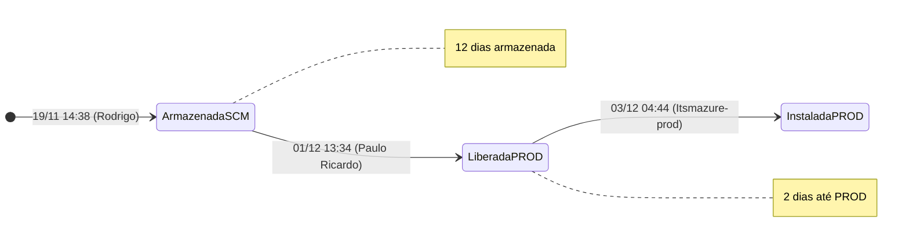

# Análise de Ciclo de Vida — Entrega #1195760

---

## 1. Ficha Técnica

| Campo | Valor |
|-------|-------|
| **ID** | 1195760 |
| **Tipo** | Entrega |
| **Título** | ENTREGA - BUG [Criação do Botão - inFlight] - Erro na página principal do inFlight |
| **Projeto** | Entrega_de_Kits (3º projeto Azure DevOps) |
| **AreaPath** | Entrega_de_Kits |
| **Estado final** | **Instalada em PROD** |
| **Reason** | Moved to state Instalada em PROD |
| **Criado** | 2025-11-19 14:38:58 |
| **Criado por** | Rodrigo Alexandre Oliveira |
| **AssignedTo** | Rodrigo Alexandre Oliveira |
| **ChangedDate** | 2025-12-03 04:44:15 |
| **ChangedBy** | Itsmazure-prod (automação ITSM) |
| **Parent** | Bug #1193756 (Projeto_Service_Creation) |
| **Revisões** | 7 |
| **Updates** | 10 |
| **Comentários** | 2 |
| **Origem** | Copiado de #1194802 |

---

## 2. Campos Específicos de Entrega

| Campo | Valor |
|-------|-------|
| **CodigoDemanda** | BUG1193756 |
| **NomeDemanda** | BUG1193756 |
| **BugVendor** | ENGINEERING |
| **VendorGroup** | Engineering - OAM |
| **BugOwnerCCC** | Mauricio Valderrama De Oliveira (mdoliveira_engineering@timbrasil.com.br) |
| **Sistema** | OAMVAS |
| **ShipmentTIM20** | OAM_BUG1193756_CAPTIVE_FLY_QA |
| **ChangeForm** | CF_BUG1193756_captiveFlyOauth |
| **ChangeNumber** | CHG0177576 |
| **Patch** | FQA |
| **Label** | 202511191141_OAMVAS_OAM_BUG1193756_CAPTIVE_FLY_QA |
| **TipoDeploy** | Manual |
| **DataPlanejada** | 2025-11-18 18:23:00 |
| **DataEntrega** | 2025-11-18 18:23:00 |
| **Responsável entrega** | Fellipe Pinheiro Moncayo (campo GUID Custom.d0f2a953) |
| **EvidenciaSystemTest** | Sim |
| **Áreas** | VAS |
| **Priority** | 4 |

### Checklist de Qualidade de Entrega (11 campos booleanos)

| Campo | Valor |
|-------|-------|
| dir_structure | Sim |
| delivery_changeset | Sim |
| delivery_change_form | Sim |
| correct_content_cf | Sim |
| info_change_form_param | Sim |
| last_delivery_change_form_install_env | **Não** |
| change_form_schema_system | **Não** |
| b_change_form_schema_system | Sim |
| redelivery_changeform | Sim |
| valid_change_form | Sim |
| VendorouVendorGroupInvalido | Valido |

> **9 de 11 campos** passaram no checklist (2 "Não"). A Entrega #1178461 (entrega original da feature) tinha 7 "Não" — esta entrega de correção está mais completa.

---

## 3. Hierarquia e Relações

```
┌─────────────────────────────────────────────────────────────────┐
│  PROJETO: Entrega_de_Kits                                       │
│                                                                 │
│  Bug #1193756 (Parent — Projeto_Service_Creation)               │
│    └── Entrega #1195760 ◄ ESTE (Child)                          │
│                                                                 │
│  Entrega #1194802 (Copied from — removido depois)               │
│    (BUG1192764 — outro bug, usado como template)                │
│                                                                 │
│  Changeset #51716 (código/config associado)                     │
│                                                                 │
│  Entrega #1178461 (entrega original da feature — sem link)      │
│                                                                 │
└─────────────────────────────────────────────────────────────────┘
```

| # | Tipo de Relação | Destino | Nome | Quando |
|---|----------------|---------|------|--------|
| 1 | Hierarchy-Reverse | Bug #1193756 | Parent | 2025-11-19 14:41:46 (Rodrigo) |
| 2 | ArtifactLink | Changeset #51716 | Fixed in Changeset | 2025-11-19 14:41:46 (Rodrigo) |
| 3 | ~~Related~~ | ~~#1194802~~ | ~~Copied from~~ | Adicionado e removido no mesmo minuto |

---

## 4. Atores

| # | Nome | E-mail | Papéis |
|---|------|--------|--------|
| 1 | Rodrigo Alexandre Oliveira | T3671925@timbrasil.com.br | Criador, AssignedTo, SCM. Criou, renomeou, corrigiu Label, vinculou changeset e Parent |
| 2 | AzDevOpsServ_PRD | AzDevOpsServ_PRD_usr@timbrasil.com.br | Automação — atualizou Label |
| 3 | Paulo Ricardo Castellanos Souza | pcsouza@timbrasil.com.br | Liberou para PROD (Armazenada → Liberada para PROD). Definiu CHG0177576 |
| 4 | Itsmazure-prod | ITSMAZURE-prod@internal.timbrasil.com.br | Automação ITSM — instalou em PROD (Liberada → Instalada em PROD) |
| 5 | Mauricio Valderrama De Oliveira | mdoliveira_engineering@timbrasil.com.br | BugOwnerCCC (campo referencial — responsável Engineering/OAM) |
| 6 | Fellipe Pinheiro Moncayo | — | Responsável pela entrega (campo GUID referencial) |

> **4 atores ativos** (2 humanos + 2 automações) e 2 referenciais. Novo ator: **Itsmazure-prod** — service account ITSM que faz o deploy em produção, não vista em nenhum WI anterior.

---

## 5. Cronologia Completa (10 Updates)

| Upd | Rev | Timestamp (UTC) | Ator | Ação |
|:---:|:---:|:---------------:|:----:|------|
| 1 | 1 | 2025-11-19 14:38:58 | Rodrigo | **Criação** (Copied from #1194802). Estado: Armazenada pelo SCM. Título: "ENTREGA - BUG BTO - 995 - Não suspende serviços VAS - **Copy**". Label: "202511191133_OAMVAS_**BUG1192764**". History: "Copied from #1194802" |
| 2 | 1 | 2025-11-19 14:38:59 | Rodrigo | **Relação**: Related → #1194802 (link de cópia adicionado) |
| 3 | 2 | 2025-11-19 14:39:07 | Rodrigo | **Título corrigido**: "ENTREGA - BUG [Criação do Botão - inFlight] - Erro na página principal do inFlight" |
| 4 | 2 | 2025-11-19 14:39:13 | Rodrigo | **Relação removida**: Related → #1194802 (link de cópia removido) |
| 5 | 3 | 2025-11-19 14:41:37 | AzDevOpsServ_PRD | **Label corrigido**: "202511191133_OAMVAS_BUG1192764" → "202511191141_OAMVAS_OAM_BUG1193756_CAPTIVE_FLY_QA" |
| 6 | 4 | 2025-11-19 14:41:46 | Rodrigo | **Parent**: Bug #1193756. **Changeset**: #51716 associado. History: "Associated with changeset 51716." CommentCount: 1→2 |
| 7 | 4 | 2025-11-19 14:44:54 | Rodrigo | **Relação adicional** (link adicional registrado no update) |
| 8 | 5 | **2025-12-01 13:34:24** | Paulo Ricardo | **Estado**: Armazenada pelo SCM → **Liberada para PROD**. ChangeNumber: CHG0177576 |
| 9 | 6 | 2025-12-03 04:44:15 | Itsmazure-prod | Ajuste de timestamp GUID (data de instalação corrigida) |
| 10 | 7 | **2025-12-03 04:44:15** | Itsmazure-prod | **Estado**: Liberada para PROD → **Instalada em PROD** (~0.3 seg após upd 9) |

---

## 6. Transições de Estado (3 transições)

| # | Data/Hora (UTC) | De | Para | Ator |
|:-:|:---------------:|:--:|:----:|:----:|
| 1 | 2025-11-19 14:38:58 | — | Armazenada pelo SCM | Rodrigo (criação) |
| 2 | 2025-12-01 13:34:24 | Armazenada pelo SCM | Liberada para PROD | Paulo Ricardo |
| 3 | 2025-12-03 04:44:15 | Liberada para PROD | Instalada em PROD | Itsmazure-prod |



> A Entrega #1178461 (feature original, analisada anteriormente) consta em estado "Armazenada pelo SCM" (rev 3). Esta Entrega percorreu todo o pipeline até "Instalada em PROD" em 14 dias.

---

## 7. Análise de Lead Times

| Fase | Início | Fim | Duração |
|------|--------|-----|---------|
| **Criação e setup SCM** | 2025-11-19 14:38 | 2025-11-19 14:44 | **~6 min** |
| **Armazenada pelo SCM** (aguardando liberação) | 2025-11-19 14:44 | 2025-12-01 13:34 | **~12 dias** |
| **Liberada para PROD** (aguardando instalação) | 2025-12-01 13:34 | 2025-12-03 04:44 | **~1 dia 15h** |
| **Ciclo total** (criação → Instalada em PROD) | 2025-11-19 14:38 | 2025-12-03 04:44 | **~14 dias** |

### Datas planejadas vs reais

| Campo | Valor |
|-------|-------|
| **DataPlanejada** | 2025-11-18 18:23 (**antes** da criação do WI!) |
| **DataEntrega** | 2025-11-18 18:23 (igual à planejada) |
| **Criação do WI** | 2025-11-19 14:38 (+20h15 após "data de entrega") |
| **Instalação real em PROD** | 2025-12-03 04:44 (+14 dias após "data de entrega") |

---

## 8. Comparação com Entrega #1178461 (Entrega original da feature)

| Campo | Entrega #1195760 (este — bug fix) | Entrega #1178461 (feature original) |
|-------|:---------------------------------:|:-----------------------------------:|
| **Tipo** | Correção de bug (OAM/OAuth) | Feature (Fraseologia + Botão) |
| **Estado final** | **Instalada em PROD** | Armazenada pelo SCM |
| **Revisões** | 7 | 3 |
| **Transições** | 3 (até PROD) | 0 |
| **Criação → Estado final** | 14 dias | rev 3 em 2025-11-05 |
| **ChangeNumber** | CHG0177576 | (nenhum) |
| **Parent** | Bug #1193756 | IT Task #1136722 |
| **CodigoDemanda** | BUG1193756 | TIR1136722 |
| **Checklist "Não"** | 2 de 11 | 7 de 11 |
| **Changeset** | #51716 | (nenhum) |
| **Copiada de** | #1194802 | #1132619 |

> A Entrega #1178461 consta em "Armazenada pelo SCM" (rev 3) no momento da sua análise. A Entrega #1195760 (bug fix) alcançou "Instalada em PROD".

---

## 9. Problemas Identificados

### P211 — Entrega copiada de outro bug (#1194802/BUG1192764) — template errado

A Entrega #1195760 foi "Copied from #1194802" (uma entrega para o BUG1192764 — outro bug, não relacionado). O título herdado era "ENTREGA - BUG BTO - 995 - Não suspende serviços VAS - Copy" e o Label inicial referenciava "BUG1192764". Rodrigo corrigiu o título (upd 3, 9 seg depois) e o Label foi corrigido pela automação (upd 5, 163 seg depois), mas o CodigoDemanda já estava correto ("BUG1193756") na criação.

**Impacto**: Padrão recorrente de copy-paste de WIs com herança de dados incorretos. Mesma prática vista no Bug #1184452 (P104 — copiado do IT Task). O risco é de campos não corrigidos ficarem com valores do WI original. Neste caso, Rodrigo foi diligente na correção, mas o link Related ao #1194802 foi adicionado automaticamente e removido ~14 seg depois — gerando 2 updates desnecessários.

---

### P212 — DataPlanejada e DataEntrega anteriores à criação do WI — retroatividade

A DataPlanejada e DataEntrega são ambas 2025-11-18 18:23:00 — **20 horas e 15 minutos antes** da criação do WI de entrega (2025-11-19 14:38:58). Isso significa que a entrega do kit ao SCM foi planejada e "executada" antes de o WI existir no Azure DevOps. O registro no tracker é retroativo.

**Impacto**: O WI de Entrega não rastreia o processo de entrega em tempo real — documenta retroativamente algo que já aconteceu. Métricas de lead time baseadas em DataPlanejada vs DataEntrega mostram 0 dias de desvio (100% on-time), quando na realidade a entrega ao SCM aconteceu antes do registro e a instalação em PROD levou 14 dias.

---

### P213 — VendorGroup "Engineering - OAM" difere do bug pai "Engineering - VAS" — inconsistência

O Bug #1193756 tem VendorGroup="Engineering - VAS". Esta Entrega #1195760 tem VendorGroup="Engineering - OAM". O sistema é "OAMVAS" e a ChangeForm referencia "captiveFlyOauth" — ou seja, é uma correção no OAM (Oracle Access Manager), não no VAS (Value Added Services).

**Impacto**: A categorização do vendor depende do WI consultado. O bug atribui ao VAS, a entrega ao OAM. Se relatórios de KPI de vendor agregam por VendorGroup, esta correção aparece em silos diferentes conforme o tipo de WI. A entrega está mais precisa (o problema era de fato no OAM/OAuth), enquanto o bug foi classificado erroneamente como VAS (P202).

---

### P214 — BugOwnerCCC novo ator (Mauricio Valderrama) — não aparece no Bug pai

O campo BugOwnerCCC da Entrega aponta para Mauricio Valderrama De Oliveira (mdoliveira_engineering@timbrasil.com.br) — um ator que **nunca apareceu** no Bug #1193756 (cujo BugOwnerCCC é Paulo Ricardo Castellanos Souza). Mauricio é da Engineering (evidenciado pelo domínio de e-mail), não do CCC TIM.

**Impacto**: A Entrega referencia um responsável diferente do Bug pai. O "BugOwnerCCC" da Entrega não é o CCC (Centro de Competência), é o responsável Engineering pelo componente OAM. Campo com semântica diferente entre tipos de WI.

---

### P215 — Entrega de bug fix alcançou PROD — Entrega da feature original consta em estado diferente

A Entrega #1195760 (correção OAuth captive fly) percorreu Armazenada → Liberada para PROD → Instalada em PROD em 14 dias. A Entrega #1178461 (feature original "Fraseologia + Botão inFlight") consta em "Armazenada pelo SCM" (rev 3) no momento da sua análise.

**Impacto**: As duas entregas relacionadas à mesma iniciativa (#1085522) estão em estados diferentes do pipeline de deploy. O estado de cada entrega no momento da extração dos dados é um fato observável que pode ser relevante para a análise do portfolio.

---

### P216 — Changeset #51716 associado — evidência de mudança de código/config real

Diferentemente de muitos WIs desta iniciativa onde as "correções" são declarativas (P102, P197), esta Entrega tem um changeset real (#51716) associado. A ChangeForm "CF_BUG1193756_captiveFlyOauth" e o Label "OAM_BUG1193756_CAPTIVE_FLY_QA" confirmam que houve uma alteração de configuração no Oracle Access Manager para corrigir o fluxo OAuth do captive portal de WiFi inFlight (Intelsat/GoGo).

**Impacto**: Esta é a evidência de que houve correção técnica real — configuração do OAM QA para o fluxo captiveFlyOauth. Confirma que o bug era de fato ambiental (config OAM), não de codificação de aplicação, reforçando P202 (classificação errada como "Codificação - System Test").

---

### P217 — Descrição vazia — entrega sem documentação

O campo System.Description contém apenas divs vazios (`<div><br></div>`). Para uma entrega que modifica configuração de OAuth em ambiente QA e eventualmente é instalada em produção, não há documentação de:
- O que foi alterado no OAM
- Parâmetros de configuração modificados
- Impacto em outros fluxos OAuth
- Rollback plan

**Impacto**: A entrega foi instalada em produção (CHG0177576) sem descrição documentada no WI. A ChangeForm existe como referência externa, mas o WI não contém a informação necessária para auditoria standalone. Padrão idêntico à Entrega #1178461 (que também não tinha Description relevante).

---

### P218 — 12 dias armazenada antes da liberação — gargalo de aprovação

A entrega ficou 12 dias em "Armazenada pelo SCM" (2025-11-19 → 2025-12-01) antes de Paulo Ricardo liberá-la para PROD. O bug pai (#1193756) foi fechado em 2025-11-19 18:27 e o reteste já havia sido completado. A correção já estava pronta, mas a aprovação de change demorou 12 dias.

**Impacto**: O ciclo de correção técnica (bug→fix→teste) levou ~28 horas, mas o deploy em produção levou 14 dias adicionais. O gargalo é o processo de change management / aprovação, não a engenharia. Para um bug classificado como "1 - Critical" na criação, 12 dias aguardando aprovação é significativo.

---

## 10. Métricas Consolidadas

| Métrica | Valor |
|---------|-------|
| **Revisões** | 7 |
| **Updates** | 10 |
| **Transições de estado** | 3 |
| **Ciclo total** (criação → Instalada em PROD) | ~14 dias |
| **Espera SCM** | ~12 dias |
| **Espera PROD** | ~1 dia 15h |
| **Setup** | ~6 min |
| **Atores únicos** | 6 (2 humanos ativos + 2 automações + 2 referenciais) |
| **Relações** | 2 (Parent + Changeset) |
| **ChangeNumber** | CHG0177576 |
| **Changeset** | #51716 |
| **Checklist qualidade** | 9/11 (82%) |
| **Problemas** | P211–P218 (8) |

---

## 11. Cronologia Cruzada — Entrega vs Bug vs Reteste vs Feature

| Data | Evento | WI |
|------|--------|-----|
| 2025-11-05 14:50 | Entrega da feature original criada (Armazenada pelo SCM) | Entrega #1178461 |
| 2025-11-18 14:00 | Bug #1193756 criado — erro OAM OAuth na página inFlight | Bug #1193756 |
| 2025-11-18 18:23 | **DataPlanejada/DataEntrega** desta Entrega (retroativa) | Entrega #1195760 |
| 2025-11-19 14:38 | **Entrega #1195760 criada** por Rodrigo (copiada de #1194802) | Entrega #1195760 |
| 2025-11-19 14:41 | Título e Label corrigidos. Changeset #51716 associado. Parent = Bug #1193756 | Entrega #1195760 |
| 2025-11-19 18:25 | Bug #1193756 resolvido por Marcio (burst de 45 seg) | Bug #1193756 |
| 2025-11-19 18:27 | Bug #1193756 fechado por Anderson. Reteste #1196133 criado | Bug #1193756 |
| 2025-12-01 13:34 | Entrega liberada para PROD por Paulo Ricardo (CHG0177576) | Entrega #1195760 |
| 2025-12-03 04:44 | **Entrega instalada em PROD** por Itsmazure-prod | Entrega #1195760 |
| — | Entrega da feature original: estado "Armazenada pelo SCM" (rev 3) | Entrega #1178461 |

---

## 12. Cadeia Completa Atualizada — Falha CY0003

| # | Tipo | ID | Projeto | Estado | Papel |
|:-:|------|----|---------|:------:|-------|
| 1 | Bug (container) | #1184452 | Projeto_Service_Creation | Closed | P100-P109 |
| 2 | Bug (real) | #1193756 | Projeto_Service_Creation | Closed | P195-P205 |
| 3 | Reteste (real) | #1196133 | Projeto_Service_Creation | Válido | P206-P210 |
| 4 | Reteste (container) | #1199583 | Projeto_Service_Creation | Válido | P92-P99 |
| 5 | **Entrega (fix)** | **#1195760** | **Entrega_de_Kits** | **Instalada em PROD** | **P211-P218** |

> **6 work items** identificados na cadeia da falha CY0003: 2 Bugs, 2 Retestes, 1 Entrega (fix) e 1 Entrega (feature). Total de problemas acumulados nesta cadeia: P92-P99, P100-P109, P195-P218.
