# Análise de Ciclo de Vida — Test Case #1171260 (CY0001 - Autenticação com sucesso)

## 1. Ficha Técnica

| Campo | Valor |
|-------|-------|
| **ID** | 1171260 |
| **Tipo** | Test Case |
| **Título** | CY0001 - Autenticação com sucesso |
| **Projeto** | Projeto_Service_Creation |
| **AreaPath** | Projeto_Service_Creation\Waterfall |
| **Estado final** | Closed |
| **Reason** | Moved out of state Enviado para Usuário |
| **Criado** | 2025-10-29 18:48:43 |
| **Closed** | 2025-11-18 22:42:38 |
| **Criado por** | Anderson Teixeira Abrantes |
| **Closed por** | AzDevOpsServ_PRD |
| **ActivatedDate** | 2025-11-17 17:09:23 |
| **ActivatedBy** | Anderson Teixeira Abrantes |
| **Revisões** | 14 |
| **Updates** | 15 |
| **Comentários** | 1 |

---

## 2. Campos Customizados

| Campo | Valor |
|-------|-------|
| **CodigoDemanda.TIMDM** | 251078031 |
| **CodigoFQA.TIMDM** | TR1164264 |
| **TesteCase.AreaUsuaria.TIMDM** | VAS |
| **TesteCase.Funcionalidade.TIMDM** | Validação de implementação resgate de senha Inflight |
| **TesteCase.Tipo.TIMDM** | UAT Delivery |
| **TesteCase.StatusGeral.TIMDM** | Fech/Canc |
| **TesteCase.Prioridade.TIMDM** | Indefinida |
| **TesteCase.NomeDemanda.TIMDM** | Alteração da Fraseologia e Criação do Botão - inFlight |
| **Custom.EquipeResponsavelFQA** | FQA - Atos |
| **Custom.Release** | Extra |
| **Custom.Complexidade** | 2 |
| **Custom.PercentualAutomacao** | 0% |
| **Custom.KPIProdutividade** | FQA - Atos |
| **Custom.TestPoint** | Não |
| **Custom.TestePosRollout** | Não |
| **TesteCase.LiderResponsavelFQA.TIMDM** | Anderson Teixeira Abrantes |
| **TesteCase.ResponsavelFQA.TIMDM** | Anderson Teixeira Abrantes |
| **TesteCase.TestApprover1.TIMDM** | Ana Maria Lopes Moreira |
| **TesteCase.TestApprover1Aprove.TIMDM** | Aprovado |
| **TesteCase.DataDelivery.TIMDM** | 2025-11-17 19:47:14 |
| **TesteCase.DataRealizada.TIMDM** | 2025-11-18 22:42:38 |
| **TesteCase.EvidenciaAnexaReqAuxiliar.TIMDM** | Já possui anexo |

### Especificação Funcional

| Campo | Valor |
|-------|-------|
| **Pré-condição** | Msisdn válido |
| **Dados de entrada** | cliente TIM em plano com acesso ao inflight |
| **Resultado esperado** | 1. Cliente loga no inflight; 2. Cliente se autentica; 3. recebe token para chamada a Api de consulta |

---

## 3. Hierarquia e Relações

```
┌─────────────────────────────────────────────────────────────┐
│  PROJETO: Projeto_Service_Creation                          │
│                                                             │
│  Test Request #1164264 (Closed)                             │
│    └── Test Case #1171260 ◄ ESTE                            │
│                                                             │
│  User Story #1113040 ── Related ── TC #1171260              │
│  Bug #1184452 ── Tests (TestedBy-Reverse) ── TC #1171260    │
│                                                             │
└─────────────────────────────────────────────────────────────┘
```

| # | Tipo de Relação | Destino | Nome |
|---|----------------|---------|------|
| 1 | System.LinkTypes.Related | User Story #1113040 | Related |
| 2 | Microsoft.VSTS.Common.TestedBy-Reverse | Bug #1184452 | Tests |

### Anexo

| Arquivo | Tamanho | Data |
|---------|---------|------|
| Autenticação com sucesso.mp4 | 650.112 bytes (635 KB) | 2025-11-17 19:46:01 |

---

## 4. Atores

| # | Nome | E-mail | Papéis |
|---|------|--------|--------|
| 1 | Anderson Teixeira Abrantes | aabrantes_atos@timbrasil.com.br | Criador, AssignedTo, Executor, LiderFQA, ResponsávelFQA, ActivatedBy |
| 2 | Ana Maria Lopes Moreira | amlmoreira@timbrasil.com.br | TestApprover1 (aprovação da área usuária) |
| 3 | Carolina Ribeiro Gomes Sundin | csundin@timbrasil.com.br | ChangedBy (rev 9 — ajuste de StackRank) |
| 4 | Joanna Maria Haslwanter | jhaslwanter@timbrasil.com.br | ChangedBy (rev 12 — ajuste de StackRank) |
| 5 | AzDevOpsServ_PRD | AzDevOpsServ_PRD_usr@timbrasil.com.br | ClosedBy (automação) |

> **5 atores** para um test case. Anderson concentra ~80% das ações. Carolina e Joanna fazem apenas ajustes de StackRank (triagem de board).

---

## 5. Cronologia Completa (15 Updates)

| Upd | Rev | Timestamp (UTC) | Ator | Ação |
|:---:|:---:|:---------------:|:----:|------|
| 1 | 1 | 2025-10-29 18:48:43 | Anderson | **Criação**. Estado: Em Revisão (FQA). Kanban: Nova História. Todos os campos iniciais |
| 2 | 2 | 2025-11-12 16:58:38 | Anderson | Define TestApprover1 = Ana Maria Lopes Moreira |
| 3 | 3 | 2025-11-13 14:25:00 | Anderson | **Estado**: Em Revisão (FQA) → **Aberto**. Kanban: Nova História → Aberto |
| 4 | 4 | 2025-11-13 14:25:24 | Anderson | Adiciona relação TestedBy-Reverse → Bug #1184452. Atualiza DataRealizada |
| 5 | 5 | 2025-11-13 14:25:37 | Anderson | **Estado**: Aberto → **Bloqueado**. Kanban → Bloqueado. StatusGeral: Com FQA → Bloq/Erro |
| 6 | 6 | 2025-11-17 15:06:28 | Anderson | **Estado**: Bloqueado → **Aberto**. Kanban → Aberto. StatusGeral → Com FQA |
| 7 | 7 | 2025-11-17 15:07:34 | Anderson | Define AssignedTo e ResponsávelFQA. Atualiza DataRealizada |
| 8 | 8 | 2025-11-17 17:09:23 | Anderson | **Estado**: Aberto → **Em Andamento**. Kanban → Em Andamento. Complexidade=2. ActivatedDate set |
| 9 | 9 | 2025-11-17 17:31:49 | Carolina | Ajuste de StackRank (triagem de board) |
| 10 | 10 | 2025-11-17 19:47:04 | Anderson | Comentário: "Teste realizado conforme especificação". **Anexo**: Autenticação com sucesso.mp4 |
| 11 | 11 | 2025-11-17 19:47:19 | Anderson | **Estado**: Em Andamento → **Enviado para Usuário**. Kanban → Enviado p/ Usuário. DataDelivery set. StatusGeral → Com Usuário |
| 12 | 11 | 2025-11-18 14:44:27 | Anderson | Adiciona relação Related → User Story #1113040 (relação apenas, sem rev increment) |
| 13 | 12 | 2025-11-18 22:34:33 | Joanna | Ajuste de StackRank |
| 14 | 13 | 2025-11-18 22:42:22 | Ana Maria | **Aprovação**: TestApprover1Aprove = "Aprovado". DataRealizada atualizada |
| 15 | 14 | 2025-11-18 22:42:38 | AzDevOpsServ_PRD | **Estado**: Enviado p/ Usuário → **Closed**. Kanban → TIR em Produção. StatusGeral → Fech/Canc |

### Transições de StatusGeral.TIMDM

```
Com FQA → Bloq/Erro → Com FQA → Com Usuário → Fech/Canc
```

---

## 6. Transições de Estado (7 transições)

| # | Data/Hora (UTC) | De | Para | Kanban | Ator |
|:-:|:---------------:|:--:|:----:|:------:|:----:|
| 1 | 2025-10-29 18:48 | — | Em Revisão (FQA) | → Nova História | Anderson |
| 2 | 2025-11-13 14:25:00 | Em Revisão (FQA) | Aberto | → Aberto | Anderson |
| 3 | 2025-11-13 14:25:37 | Aberto | Bloqueado | → Bloqueado | Anderson |
| 4 | 2025-11-17 15:06:28 | Bloqueado | Aberto | → Aberto | Anderson |
| 5 | 2025-11-17 17:09:23 | Aberto | Em Andamento | → Em Andamento | Anderson |
| 6 | 2025-11-17 19:47:19 | Em Andamento | Enviado para Usuário | → Enviado p/ Usuário | Anderson |
| 7 | 2025-11-18 22:42:38 | Enviado p/ Usuário | Closed | → TIR em Produção | AzDevOpsServ_PRD |

```mermaid
stateDiagram-v2
    direction LR
    [*] --> EmRevisaoFQA: 29/10 criação
    EmRevisaoFQA --> Aberto: 13/11 14:25 (15 dias)
    Aberto --> Bloqueado: 13/11 14:25 (0 seg)
    Bloqueado --> Aberto2: 17/11 15:06 (4 dias)
    Aberto2 --> EmAndamento: 17/11 17:09 (2h)
    EmAndamento --> EnviadoUsuario: 17/11 19:47 (2h38m)
    EnviadoUsuario --> Closed: 18/11 22:42 (27h)
```



---

## 7. Análise de Lead Times

| Fase | Duração | % do Ciclo |
|------|---------|:----------:|
| **Dormência** (criação → 1ª ação) | 14 dias 19h | 74% |
| **Bloqueio** (Bloqueado → Aberto) | 3 dias 24h37m | 20% |
| **Execução real** (Em Andamento → Enviado) | 2h 38min | 0,55% |
| **Espera aprovação** (Enviado → Closed) | 26h 55min | 5,6% |
| **Ciclo total** (criação → Closed) | **20 dias 3h 54min** | 100% |

> **Razão trabalho/espera**: 0,55%. Para cada minuto de teste efetivo, 182 minutos de espera.

---

## 8. Problemas Identificados

### P71 — 15 dias de dormência entre criação e primeira ação

O TC foi criado em 2025-10-29 mas só teve a primeira ação real (transição para Aberto) em 2025-11-13 14:25. Ficou 15 dias intocado no estado "Em Revisão (FQA)". A criação dos Test Cases é desacoplada da disponibilidade do ambiente de testes — o processo cria artefatos cerimonialmente antes de haver condições de execução.

**Impacto**: Inflação artificial do lead time. Os 20 dias de ciclo incluem 15 onde nenhum trabalho foi realizado.

---

### P72 — Aberto → Bloqueado em 0 segundos — estado Aberto é waypoint obrigatório

A transição Em Revisão (FQA) → Aberto → Bloqueado ocorreu no mesmo minuto (14:25 em 2025-11-13, com 37 segundos entre Aberto e Bloqueado). O estado "Aberto" teve duração efetiva zero — é um waypoint obrigatório no workflow antes de poder registrar o bloqueio real.

**Impacto**: Workflow com estados intermediários que não correspondem a etapas reais. O ator faz 2 transições para registrar 1 fato.

---

### P73 — Bloqueio de 4 dias por dependência de ambiente compartilhado

O TC ficou bloqueado de 2025-11-13 a 2025-11-17 (segunda-feira). Mesmo padrão que os outros 2 TCs (CY0002, CY0003) — desbloqueio simultâneo indica dependência de infraestrutura compartilhada, não do teste individual.

**Impacto**: O processo de FQA espera passivamente pelo ambiente, com work items carimbando o mesmo problema de forma redundante.

---

### P74 — Execução real de 2h38min em ciclo de 20 dias (0,55%)

O trabalho efetivo (Em Andamento 17:09 → Enviado p/ Usuário 19:47 em 2025-11-17) durou aproximadamente 2h38min. Isso inclui a gravação de vídeo MP4 como evidência. O restante do ciclo de 20 dias foi dormência, bloqueio e espera.

**Impacto**: O overhead processual consome 99,45% do lead time.

---

### P75 — Ator único em todo o ciclo — criador = executor = validador

Anderson Teixeira Abrantes é o criador, executor, responsável FQA e líder FQA. Os outros 4 atores contribuem marginalmente: Carolina e Joanna fazem ajustes de StackRank (triagem), Ana Maria aprova, e a automação fecha. Não há segregação entre quem escreve, executa e valida o teste.

**Impacto**: Concentração total sem peer review funcional. A "validação" é feita pelo mesmo ator que executou.

---

### P76 — Aprovação de Ana Maria e closing por automação distam 16 segundos

Ana Maria aprovou ("Aprovado") em 22:42:22 e o AzDevOpsServ_PRD fechou em 22:42:38 — **16 segundos** de diferença. Isso indica que o closing é automatizado e dispara imediatamente após a aprovação, sem janela para revisão da evidência em vídeo (MP4 de 635 KB).

**Impacto**: O gate de aprovação é cerimonial — não há tempo para verificar a evidência antes do encerramento automático.

---

### P77 — Prioridade "Indefinida" durante todo o ciclo de vida

O campo `TesteCase.Prioridade.TIMDM` permaneceu "Indefinida" em todas as 14 revisões, apesar do TC ter sido executado, aprovado e fechado. Nunca foi classificado.

**Impacto**: Impossibilita priorização de backlog de testes e análise de risco vs esforço de execução.

---

### P78 — 0% automação para cenário repetível

`PercentualAutomacao = 0%`, `TestPoint = Não`. A evidência é um vídeo MP4 de screencast manual. O cenário CY0001 (autenticação com sucesso) é candidato óbvio à automação — fluxo happy path de login + validação de token.

**Impacto**: Custo de revalidação manual perpetuado. Cada release futuro requerá intervenção humana para retestar este cenário.

---

## 9. Métricas Consolidadas

| Métrica | Valor |
|---------|-------|
| **Revisões** | 14 |
| **Updates** | 15 |
| **Transições de estado** | 7 |
| **Ciclo total** | 20 dias |
| **Trabalho real** | ~2h38min |
| **Razão trabalho/espera** | 0,55% |
| **Atores únicos** | 5 |
| **Anexos** | 1 (MP4, 635 KB) |
| **Bugs vinculados** | 1 (#1184452) |
| **Retestes** | 0 |
| **Problemas** | P71–P78 (8) |
