# Análise de Ciclo de Vida — Test Case #1171261 (CY0002 - Resgate de Senha)

## 1. Ficha Técnica

| Campo | Valor |
|-------|-------|
| **ID** | 1171261 |
| **Tipo** | Test Case |
| **Título** | CY0002 - Resgate de Senha |
| **Projeto** | Projeto_Service_Creation |
| **AreaPath** | Projeto_Service_Creation\Waterfall |
| **Estado final** | Closed |
| **Reason** | Moved out of state Enviado para Usuário |
| **Criado** | 2025-10-29 18:48:43 |
| **Closed** | 2025-11-18 22:40:51 |
| **Criado por** | Anderson Teixeira Abrantes |
| **Closed por** | AzDevOpsServ_PRD |
| **ActivatedDate** | 2025-11-17 19:48:50 |
| **ActivatedBy** | Anderson Teixeira Abrantes |
| **Revisões** | 15 |
| **Updates** | 16 |
| **Comentários** | 1 |

---

## 2. Campos Customizados

| Campo | Valor |
|-------|-------|
| **CodigoDemanda.TIMDM** | 251078031 |
| **CodigoFQA.TIMDM** | TR1164264 |
| **TesteCase.AreaUsuaria.TIMDM** | VAS |
| **TesteCase.Funcionalidade.TIMDM** | Validação de implementação resgate de senha Inflight |
| **TesteCase.Tipo.TIMDM** | UAT Delivery |
| **TesteCase.StatusGeral.TIMDM** | Fech/Canc |
| **TesteCase.Prioridade.TIMDM** | Indefinida |
| **TesteCase.NomeDemanda.TIMDM** | Alteração da Fraseologia e Criação do Botão - inFlight |
| **Custom.EquipeResponsavelFQA** | FQA - Atos |
| **Custom.Release** | Extra |
| **Custom.Complexidade** | 2 |
| **Custom.PercentualAutomacao** | 0% |
| **Custom.KPIProdutividade** | FQA - Atos |
| **Custom.TestPoint** | Não |
| **Custom.TestePosRollout** | Não |
| **TesteCase.LiderResponsavelFQA.TIMDM** | Anderson Teixeira Abrantes |
| **TesteCase.ResponsavelFQA.TIMDM** | Anderson Teixeira Abrantes |
| **TesteCase.TestApprover1.TIMDM** | Ana Maria Lopes Moreira |
| **TesteCase.TestApprover1Aprove.TIMDM** | Aprovado |
| **TesteCase.DataDelivery.TIMDM** | 2025-11-17 19:57:26 |
| **TesteCase.DataRealizada.TIMDM** | 2025-11-18 22:40:51 |
| **TesteCase.EvidenciaAnexaReqAuxiliar.TIMDM** | Já possui anexo |

### Especificação Funcional

| Campo | Valor |
|-------|-------|
| **Pré-condição** | Msisdn válido |
| **Dados de entrada** | cliente TIM em plano com acesso ao inflight |
| **Resultado esperado** | 1. Cliente lloga no indlight; 2. solicita o resgate da senha; 3. recebe a senha; 4. utiliza a senha na autenticação |

> **Nota**: O resultado esperado contém erros de digitação ("lloga", "indlight") — texto preservado como-está do JSON original.

---

## 3. Hierarquia e Relações

```
┌─────────────────────────────────────────────────────────────┐
│  PROJETO: Projeto_Service_Creation                          │
│                                                             │
│  Test Request #1164264 (Closed)                             │
│    └── Test Case #1171261 ◄ ESTE                            │
│                                                             │
│  User Story #1113040 ── Related ── TC #1171261              │
│  Bug #1184452 ── Tests (TestedBy-Reverse) ── TC #1171261    │
│                                                             │
└─────────────────────────────────────────────────────────────┘
```

| # | Tipo de Relação | Destino | Nome |
|---|----------------|---------|------|
| 1 | System.LinkTypes.Related | User Story #1113040 | Related |
| 2 | Microsoft.VSTS.Common.TestedBy-Reverse | Bug #1184452 | Tests |

### Anexos

| Arquivo | Tamanho | Data |
|---------|---------|------|
| Recuperação de senha P1.mp4 | 982.880 bytes (960 KB) | 2025-11-17 19:57:19 |
| Recuperação de senha P2.mp4 | 456.317 bytes (446 KB) | 2025-11-17 19:57:19 |

---

## 4. Atores

| # | Nome | E-mail | Papéis |
|---|------|--------|--------|
| 1 | Anderson Teixeira Abrantes | aabrantes_atos@timbrasil.com.br | Criador, Executor, LiderFQA, ResponsávelFQA, ActivatedBy |
| 2 | Ana Maria Lopes Moreira | amlmoreira@timbrasil.com.br | TestApprover1 (aprovação da área usuária) |
| 3 | Carolina Ribeiro Gomes Sundin | csundin@timbrasil.com.br | ChangedBy (rev 7 — ajuste de StackRank) |
| 4 | Joanna Maria Haslwanter | jhaslwanter@timbrasil.com.br | ChangedBy (rev 13 — ajuste de StackRank) |
| 5 | AzDevOpsServ_PRD | AzDevOpsServ_PRD_usr@timbrasil.com.br | ClosedBy (automação) |

> **5 atores** — padrão idêntico ao TC #1171260. Anderson concentra ~80% das ações.

---

## 5. Cronologia Completa (16 Updates)

| Upd | Rev | Timestamp (UTC) | Ator | Ação |
|:---:|:---:|:---------------:|:----:|------|
| 1 | 1 | 2025-10-29 18:48:43 | Anderson | **Criação**. Estado: Em Revisão (FQA). Kanban: Nova História |
| 2 | 2 | 2025-11-12 16:58:36 | Anderson | Define TestApprover1 = Ana Maria Lopes Moreira |
| 3 | 3 | 2025-11-13 14:25:00 | Anderson | **Estado**: Em Revisão (FQA) → **Aberto**. Kanban → Aberto |
| 4 | 4 | 2025-11-13 14:25:24 | Anderson | Adiciona relação TestedBy-Reverse → Bug #1184452 |
| 5 | 5 | 2025-11-13 14:25:37 | Anderson | **Estado**: Aberto → **Bloqueado**. Kanban → Bloqueado. StatusGeral: Com FQA → Bloq/Erro |
| 6 | 6 | 2025-11-17 15:06:28 | Anderson | **Estado**: Bloqueado → **Aberto**. Kanban → Aberto. StatusGeral → Com FQA |
| 7 | 7 | 2025-11-17 17:31:49 | Carolina | Ajuste de StackRank (triagem de board) |
| 8 | 8 | 2025-11-17 19:48:50 | Anderson | **Estado**: Aberto → **Em Andamento**. Kanban → Em Andamento. Complexidade=2. ResponsávelFQA set. ActivatedDate set |
| 9 | 9 | 2025-11-17 19:53:18 | Anderson | Comentário: "Teste realizado com sucesso. Senha enviada para SMS...". CommentCount 0→1 |
| 10 | 10 | 2025-11-17 19:53:37 | Anderson | System.History set (comentário com log técnico e imagem) |
| 11 | 11 | 2025-11-17 19:57:22 | Anderson | **Anexos**: Recuperação de senha P1.mp4 + P2.mp4. DataRealizada atualizada |
| 12 | 12 | 2025-11-17 19:57:31 | Anderson | **Estado**: Em Andamento → **Enviado para Usuário**. Kanban → Enviado p/ Usuário. DataDelivery set. StatusGeral → Com Usuário |
| 13 | 12 | 2025-11-18 14:44:27 | Anderson | Adiciona relação Related → User Story #1113040 (relação apenas, sem rev increment) |
| 14 | 13 | 2025-11-18 22:34:33 | Joanna | Ajuste de StackRank |
| 15 | 14 | 2025-11-18 22:40:21 | Ana Maria | **Aprovação**: TestApprover1Aprove = "Aprovado" |
| 16 | 15 | 2025-11-18 22:40:51 | AzDevOpsServ_PRD | **Estado**: Enviado p/ Usuário → **Closed**. Kanban → TIR em Produção. StatusGeral → Fech/Canc |

### Transições de StatusGeral.TIMDM

```
Com FQA → Bloq/Erro → Com FQA → Com Usuário → Fech/Canc
```

---

## 6. Transições de Estado (7 transições)

| # | Data/Hora (UTC) | De | Para | Kanban | Ator |
|:-:|:---------------:|:--:|:----:|:------:|:----:|
| 1 | 2025-10-29 18:48 | — | Em Revisão (FQA) | → Nova História | Anderson |
| 2 | 2025-11-13 14:25:00 | Em Revisão (FQA) | Aberto | → Aberto | Anderson |
| 3 | 2025-11-13 14:25:37 | Aberto | Bloqueado | → Bloqueado | Anderson |
| 4 | 2025-11-17 15:06:28 | Bloqueado | Aberto | → Aberto | Anderson |
| 5 | 2025-11-17 19:48:50 | Aberto | Em Andamento | → Em Andamento | Anderson |
| 6 | 2025-11-17 19:57:31 | Em Andamento | Enviado para Usuário | → Enviado p/ Usuário | Anderson |
| 7 | 2025-11-18 22:40:51 | Enviado p/ Usuário | Closed | → TIR em Produção | AzDevOpsServ_PRD |

```mermaid
stateDiagram-v2
    direction LR
    [*] --> EmRevisaoFQA: 29/10 criação
    EmRevisaoFQA --> Aberto: 13/11 14:25 (15 dias)
    Aberto --> Bloqueado: 13/11 14:25 (37 seg)
    Bloqueado --> Aberto2: 17/11 15:06 (4 dias)
    Aberto2 --> EmAndamento: 17/11 19:48 (4h42m)
    EmAndamento --> EnviadoUsuario: 17/11 19:57 (8min41seg)
    EnviadoUsuario --> Closed: 18/11 22:40 (26h43m)
```



---

## 7. Análise de Lead Times

| Fase | Duração | % do Ciclo |
|------|---------|:----------:|
| **Dormência** (criação → 1ª ação) | 14 dias 19h | 74% |
| **Bloqueio** (Bloqueado → Aberto) | 4 dias 0h 41m | 20% |
| **Execução real** (Em Andamento → Enviado) | **8 min 41 seg** | 0,03% |
| **Espera aprovação** (Enviado → Closed) | 26h 43min | 5,5% |
| **Ciclo total** (criação → Closed) | **20 dias 3h 52min** | 100% |

> **Razão trabalho/espera**: 0,03%. Para cada minuto de teste efetivo, **3.333 minutos de espera**. Este é o TC com a menor razão de trabalho real de toda a iniciativa.

---

## 8. Problemas Identificados

### P79 — Execução real de 8min41seg em ciclo de 20 dias (0,03%)

CY0002 é o test case com a menor razão trabalho/espera de toda a iniciativa. O teste efetivo (Em Andamento 19:48 → Enviado p/ Usuário 19:57 em 2025-11-17) durou menos de 9 minutos. Isso inclui executar o cenário, gravar 2 vídeos MP4 e anexar a evidência. O restante do ciclo de 20 dias é dormência, bloqueio e espera por aprovação.

**Impacto**: O overhead processual consome 99,97% do lead time. O caso de teste mais simples (resgate de senha — 4 passos) gera 20 dias de ciclo.

---

### P80 — Erros de digitação no resultado esperado — especificação não revisada

O campo ResultadoEsperado contém "lloga" (em vez de "loga") e "indlight" (em vez de "inflight"). Esses erros existem desde a revisão 1 e persistiram ao longo de todas as 15 revisões e 16 updates sem que ninguém corrigisse.

**Impacto**: Evidência de que a especificação funcional do test case não passou por review. Os campos de especificação são preenchidos na criação e nunca mais verificados.

---

### P81 — Aprovação e closing distam 30 segundos — gate cerimonial

Ana Maria aprovou ("Aprovado") em 22:40:21 e o AzDevOpsServ_PRD fechou em 22:40:51 — **30 segundos** de diferença. O closing é automatizado e dispara imediatamente após o campo de aprovação ser preenchido, sem janela para revisão da evidência (2 vídeos MP4 totalizando 1,4 MB).

**Impacto**: O gate de aprovação existe no workflow mas não opera como verificação funcional — é trigger de automação.

---

### P82 — 2 vídeos MP4 como evidência para cenário de 4 passos

O CY0002 tem 2 vídeos separados (P1 + P2) para um cenário de 4 passos sequenciais. A gravação em 2 partes sugere que a captura foi interrompida e retomada — overhead de gravação para teste manual.

**Impacto**: Evidência fragmentada. Comparado com CY0001 (1 vídeo) e CY0003 (1 vídeo, após reteste), o CY0002 foi o que exigiu menos tempo de execução (8min) mas gerou 2 artefatos de evidência.

---

### P83 — Prioridade "Indefinida" e 0% automação — padrão de todos os TCs

O campo `Prioridade.TIMDM` permaneceu "Indefinida" em todas as 15 revisões. `PercentualAutomacao = 0%` e `TestPoint = Não`. Padrão idêntico aos TCs #1171260 e #1171262 — campos de gestão sistematicamente ignorados.

**Impacto**: Impossibilita análise de cobertura de testes automatizados e priorização de backlog.

---

## 9. Métricas Consolidadas

| Métrica | Valor |
|---------|-------|
| **Revisões** | 15 |
| **Updates** | 16 |
| **Transições de estado** | 7 |
| **Ciclo total** | 20 dias |
| **Trabalho real** | ~8min 41seg |
| **Razão trabalho/espera** | 0,03% |
| **Atores únicos** | 5 |
| **Anexos** | 2 (MP4, 960 KB + 446 KB) |
| **Bugs vinculados** | 1 (#1184452) |
| **Retestes** | 0 |
| **Problemas** | P79–P83 (5) |
