# Análise de Ciclo de Vida — Test Case #1171262 (CY0003 - Retornar a pagina do inflight após autenticação)

## 1. Ficha Técnica

| Campo | Valor |
|-------|-------|
| **ID** | 1171262 |
| **Tipo** | Test Case |
| **Título** | CY0003 - Retornar a pagina do inflight após autenticação |
| **Projeto** | Projeto_Service_Creation |
| **AreaPath** | Projeto_Service_Creation\Waterfall |
| **Estado final** | Closed |
| **Reason** | Moved out of state Enviado para Usuário |
| **Criado** | 2025-10-29 18:48:43 |
| **Closed** | 2025-11-19 21:30:10 |
| **Criado por** | Anderson Teixeira Abrantes |
| **Closed por** | AzDevOpsServ_PRD |
| **ActivatedDate** | 2025-11-19 18:27:55 |
| **ActivatedBy** | Anderson Teixeira Abrantes |
| **Revisões** | 23 |
| **Updates** | 24 |
| **Comentários** | 1 |

---

## 2. Campos Customizados

| Campo | Valor |
|-------|-------|
| **CodigoDemanda.TIMDM** | 251078031 |
| **CodigoFQA.TIMDM** | TR1164264 |
| **TesteCase.AreaUsuaria.TIMDM** | VAS |
| **TesteCase.Funcionalidade.TIMDM** | Validação de implementação resgate de senha Inflight |
| **TesteCase.Tipo.TIMDM** | UAT Delivery |
| **TesteCase.StatusGeral.TIMDM** | Fech/Canc |
| **TesteCase.Prioridade.TIMDM** | Indefinida |
| **TesteCase.NomeDemanda.TIMDM** | Alteração da Fraseologia e Criação do Botão - inFlight |
| **Custom.EquipeResponsavelFQA** | FQA - Atos |
| **Custom.Release** | Extra |
| **Custom.Complexidade** | 2 |
| **Custom.PercentualAutomacao** | 0% |
| **Custom.KPIProdutividade** | FQA - Atos |
| **Custom.TestPoint** | Não |
| **Custom.TestePosRollout** | Não |
| **TesteCase.Liberado.TIMDM** | Não |
| **TesteCase.LiderResponsavelFQA.TIMDM** | Anderson Teixeira Abrantes |
| **TesteCase.ResponsavelFQA.TIMDM** | Anderson Teixeira Abrantes |
| **TesteCase.TestApprover1.TIMDM** | Ana Maria Lopes Moreira |
| **TesteCase.TestApprover1Aprove.TIMDM** | Aprovado |
| **TesteCase.DataDelivery.TIMDM** | 2025-11-19 18:28:18 |
| **TesteCase.DataRealizada.TIMDM** | 2025-11-19 21:30:10 |
| **TesteCase.EvidenciaAnexaReqAuxiliar.TIMDM** | Já possui anexo |

### Especificação Funcional

| Campo | Valor |
|-------|-------|
| **Pré-condição** | Msisdn Válido |
| **Dados de entrada** | cliente TIM em plano com acesso ao inflight |
| **Resultado esperado** | 1. Cliente executou a jornada de resgate de senha; 2. Cliente recebeu a mensagem de senha enviada; 3. Cliente retorna para aplicação inflight |

---

## 3. Hierarquia e Relações

```
┌─────────────────────────────────────────────────────────────┐
│  PROJETO: Projeto_Service_Creation                          │
│                                                             │
│  Test Request #1164264 (Closed)                             │
│    └── Test Case #1171262 ◄ ESTE                            │
│                                                             │
│  User Story #1113040 ── Related ── TC #1171262              │
│  Bug #1184452 ── Tests (TestedBy-Reverse) ── TC #1171262    │
│  Bug #1193756 ── Tests (TestedBy-Reverse) ── TC #1171262    │
│                                                             │
└─────────────────────────────────────────────────────────────┘
```

| # | Tipo de Relação | Destino | Nome | Observação |
|---|----------------|---------|------|------------|
| 1 | System.LinkTypes.Related | User Story #1113040 | Related | Adicionado no update 13 |
| 2 | Microsoft.VSTS.Common.TestedBy-Reverse | Bug #1184452 | Tests | Adicionado no update 4 |
| 3 | Microsoft.VSTS.Common.TestedBy-Reverse | Bug #1193756 | Tests | Adicionado no update 12 (junto com a falha) |

> **Nota**: Único TC com 2 Bugs vinculados. Bug #1193756 aparece apenas neste TC — associado ao momento da falha (Falhado).

### Anexos (estado final — após substituição)

| Arquivo | Tamanho | Data |
|---------|---------|------|
| Recuperaçao de senha retorno a pagina.mp4 | 1.146.695 bytes (1,1 MB) | 2025-11-19 17:46:52 |

> **Historico de anexos**: Os vídeos originais (Recuperação de senha P1.mp4, 983 KB + P2.mp4, 456 KB) foram adicionados no update 9 e **substituídos** no update 17 pelo vídeo do reteste.

---

## 4. Atores

| # | Nome | E-mail | Papéis |
|---|------|--------|--------|
| 1 | Anderson Teixeira Abrantes | aabrantes_atos@timbrasil.com.br | Criador, Executor, LiderFQA, ResponsávelFQA, ActivatedBy |
| 2 | Ana Maria Lopes Moreira | amlmoreira@timbrasil.com.br | TestApprover1 (aprovação da área usuária) |
| 3 | Carolina Ribeiro Gomes Sundin | csundin@timbrasil.com.br | ChangedBy (rev 7 — ajuste de StackRank) |
| 4 | Joanna Maria Haslwanter | jhaslwanter@timbrasil.com.br | ChangedBy (rev 13 — ajuste de StackRank) |
| 5 | AzDevOpsServ_PRD | AzDevOpsServ_PRD_usr@timbrasil.com.br | ClosedBy (automação) + Set Liberado=Não (update 18) |

> **5 atores** — mesmo elenco dos outros 2 TCs. A automação (AzDevOpsServ_PRD) aparece pela primeira vez em papel intermediário (set Liberado=Não, update 18) além do closing.

---

## 5. Cronologia Completa (24 Updates)

| Upd | Rev | Timestamp (UTC) | Ator | Ação |
|:---:|:---:|:---------------:|:----:|------|
| 1 | 1 | 2025-10-29 18:48:43 | Anderson | **Criação**. Estado: Em Revisão (FQA). Kanban: Nova História |
| 2 | 2 | 2025-11-12 16:58:34 | Anderson | Define TestApprover1 = Ana Maria Lopes Moreira |
| 3 | 3 | 2025-11-13 14:25:00 | Anderson | **Estado**: Em Revisão (FQA) → **Aberto**. Kanban → Aberto |
| 4 | 4 | 2025-11-13 14:25:24 | Anderson | Adiciona TestedBy-Reverse → Bug #1184452 |
| 5 | 5 | 2025-11-13 14:25:37 | Anderson | **Estado**: Aberto → **Bloqueado**. StatusGeral: Com FQA → Bloq/Erro |
| 6 | 6 | 2025-11-17 15:06:28 | Anderson | **Estado**: Bloqueado → **Aberto**. StatusGeral → Com FQA |
| 7 | 7 | 2025-11-17 17:31:49 | Carolina | Ajuste de StackRank (triagem de board) |
| 8 | 8 | 2025-11-17 19:58:52 | Anderson | **Estado**: Aberto → **Em Andamento**. Complexidade=2. ResponsávelFQA set |
| 9 | 9 | 2025-11-17 20:18:30 | Anderson | **Anexos**: P1.mp4 + P2.mp4 adicionados. Comentário. CommentCount 0→1 |
| 10 | 10 | 2025-11-17 20:18:41 | Anderson | **Estado**: Em Andamento → **Enviado para Usuário**. DataDelivery set. StatusGeral → Com Usuário |
| 11 | 11 | 2025-11-18 11:48:36 | Anderson | **Estado**: Enviado p/ Usuário → **Em Andamento** ← REJEITADO. StatusGeral → Com FQA |
| 12 | 12 | 2025-11-18 14:03:02 | Anderson | **Estado**: Em Andamento → **Falhado**. StatusGeral → Bloq/Erro. Adiciona TestedBy-Reverse → Bug #1193756 |
| 13 | 12 | 2025-11-18 14:44:27 | Anderson | Adiciona relação Related → User Story #1113040 |
| 14 | 13 | 2025-11-18 22:34:33 | Joanna | Ajuste de StackRank |
| 15 | 14 | 2025-11-19 17:47:08 | Anderson | Deleta comentário anterior. CommentCount 1→0 |
| 16 | 15 | 2025-11-19 17:47:33 | Anderson | Novo comentário com evidência do reteste. CommentCount 0→1 |
| 17 | 16 | 2025-11-19 17:47:38 | Anderson | **Substituição de anexos**: Remove P1.mp4 + P2.mp4. Adiciona "Recuperaçao de senha retorno a pagina.mp4" |
| 18 | 17 | 2025-11-19 18:26:20 | AzDevOpsServ_PRD | Set Liberado=Não (automação intermediária) |
| 19 | 18 | 2025-11-19 18:27:46 | Anderson | **Estado**: Falhado → **Retestar**. StatusGeral: Bloq/Erro → Retestar |
| 20 | 19 | 2025-11-19 18:27:52 | Anderson | **Estado**: Retestar → **Aberto**. StatusGeral → Com FQA. DefeitoAssociado cleared |
| 21 | 20 | 2025-11-19 18:27:55 | Anderson | **Estado**: Aberto → **Em Andamento**. ActivatedDate set |
| 22 | 21 | 2025-11-19 18:28:20 | Anderson | **Estado**: Em Andamento → **Enviado para Usuário**. DataDelivery atualizado. StatusGeral → Com Usuário |
| 23 | 22 | 2025-11-19 21:29:37 | Ana Maria | **Aprovação**: TestApprover1Aprove = "Aprovado" |
| 24 | 23 | 2025-11-19 21:30:10 | AzDevOpsServ_PRD | **Estado**: Enviado p/ Usuário → **Closed**. StatusGeral → Fech/Canc |

### Transições de StatusGeral.TIMDM

```
Com FQA → Bloq/Erro → Com FQA → Com Usuário → Com FQA → Bloq/Erro → Retestar → Com FQA → Com Usuário → Fech/Canc
```

---

## 6. Transições de Estado (13 transições — ÚNICO TC COM RETESTE)

| # | Data/Hora (UTC) | De | Para | Kanban | Ator |
|:-:|:---------------:|:--:|:----:|:------:|:----:|
| 1 | 2025-10-29 18:48 | — | Em Revisão (FQA) | → Nova História | Anderson |
| 2 | 2025-11-13 14:25:00 | Em Revisão (FQA) | Aberto | → Aberto | Anderson |
| 3 | 2025-11-13 14:25:37 | Aberto | Bloqueado | → Bloqueado | Anderson |
| 4 | 2025-11-17 15:06:28 | Bloqueado | Aberto | → Aberto | Anderson |
| 5 | 2025-11-17 19:58:52 | Aberto | Em Andamento | → Em Andamento | Anderson |
| 6 | 2025-11-17 20:18:41 | Em Andamento | Enviado para Usuário | → Enviado p/ Usuário | Anderson |
| 7 | 2025-11-18 11:48:36 | Enviado p/ Usuário | Em Andamento | → Em Andamento | Anderson |
| 8 | 2025-11-18 14:03:02 | Em Andamento | Falhado | → Falhado | Anderson |
| 9 | 2025-11-19 18:27:46 | Falhado | Retestar | → Retestar | Anderson |
| 10 | 2025-11-19 18:27:52 | Retestar | Aberto | → Aberto | Anderson |
| 11 | 2025-11-19 18:27:55 | Aberto | Em Andamento | → Em Andamento | Anderson |
| 12 | 2025-11-19 18:28:20 | Em Andamento | Enviado para Usuário | → Enviado p/ Usuário | Anderson |
| 13 | 2025-11-19 21:30:10 | Enviado p/ Usuário | Closed | → TIR em Produção | AzDevOpsServ_PRD |

```mermaid
stateDiagram-v2
    direction LR
    [*] --> EmRevisaoFQA: 29/10 criação
    EmRevisaoFQA --> Aberto: 13/11 (15 dias)
    Aberto --> Bloqueado: 13/11 (0 seg)
    Bloqueado --> Aberto2: 17/11 (4 dias)
    Aberto2 --> EmAndamento: 17/11 19:58
    EmAndamento --> EnviadoUsuario: 17/11 20:18 (20 min)
    EnviadoUsuario --> EmAndamento2: 18/11 11:48 (15h)

    note right of EmAndamento2: REJEITADO

    EmAndamento2 --> Falhado: 18/11 14:03 (2h15m)
    Falhado --> Retestar: 19/11 18:27 (28h)
    Retestar --> Aberto3: 19/11 18:27 (6 seg)
    Aberto3 --> EmAndamento3: 19/11 18:27 (3 seg)
    EmAndamento3 --> EnviadoUsuario2: 19/11 18:28 (25 seg)
    EnviadoUsuario2 --> Closed: 19/11 21:30 (3h)
```



---

## 7. Análise de Lead Times

### 7.1 Breakdown por Fase

| Fase | Duração | % do Ciclo |
|------|---------|:----------:|
| **Dormência** (criação → 1ª ação) | 14 dias 19h | 70% |
| **Bloqueio** (Bloqueado → Aberto) | 4 dias 0h 41m | 19% |
| **1ª execução** (Em Andamento → Enviado p/ Usuário) | ~20 min | 0,07% |
| **Rejeição + análise** (Enviado → Falhado) | ~26h 14m | 5,2% |
| **Espera reteste** (Falhado → início reteste) | ~28h 24m | 5,6% |
| **Reteste efetivo** (Retestar→...→Enviado) | **34 segundos** | 0,002% |
| **Aprovação + closing** (Enviado → Closed) | ~3h 02m | 0,6% |
| **Ciclo total** (criação → Closed) | **21 dias 2h 41min** | 100% |

### 7.2 Eficiência

| Métrica | Valor |
|---------|-------|
| **Tempo de trabalho real (1ª exec + reteste)** | ~20 min 34 seg |
| **Tempo de espera/overhead** | ~21 dias |
| **Razão trabalho/espera** | 0,07% |

### 7.3 O Reteste em Detalhe

| Transição | Timestamp | Δt |
|-----------|-----------|:--:|
| Falhado → Retestar | 2025-11-19 18:27:46 | — |
| Retestar → Aberto | 2025-11-19 18:27:52 | **6 seg** |
| Aberto → Em Andamento | 2025-11-19 18:27:55 | **3 seg** |
| Em Andamento → Enviado p/ Usuário | 2025-11-19 18:28:20 | **25 seg** |

> **3 transições em 9 segundos** (18:27:46 → 18:27:55) para chegar ao estado funcional. O reteste real (gravação de novo vídeo) foi feito **antes** dessas transições — o vídeo do reteste foi anexado às 17:47:38, 40 minutos antes de iniciar as transições de estado.

---

## 8. Problemas Identificados

### P84 — 13 transições de estado — complexidade de workflow para cenário de falha

CY0003 tem quase o dobro de transições (13) comparado aos CY0001 e CY0002 (7 cada). O workflow de reteste exige percorrer Falhado → Retestar → Aberto → Em Andamento → Enviado para Usuário — 4 transições para registrar uma ação simples ("retestei e passou"). Não há caminho direto Falhado → Enviado para Usuário.

**Impacto**: Overhead de workflow exponencial no cenário de falha. Os 23 revisions do TC (vs 14-15 dos outros) são em grande parte transições-carimbo.

---

### P85 — 3 transições em 9 segundos — Retestar→Aberto→Em Andamento é ritual

As transições 9-10-11 (Retestar → Aberto → Em Andamento) ocorreram em 9 segundos (18:27:46 → 18:27:55). Nenhuma destas representa trabalho real — o ator simplesmente clica 3 vezes para chegar ao estado desejado. Os estados "Retestar" e "Aberto" são waypoints obrigatórios sem função.

**Impacto**: 3 cliques, 3 registros de auditoria, 3 updates no banco de dados — para registrar uma intenção ("vou retestar").

---

### P86 — Reteste feito ANTES das transições de estado — workflow descolado do trabalho

O vídeo de reteste ("Recuperaçao de senha retorno a pagina.mp4") foi anexado às 17:47:38. As transições de estado Falhado→Retestar→Aberto→Em Andamento→Enviado só começaram às 18:27:46 — **40 minutos depois** do trabalho já ter sido concluído. O ator completou o reteste, gravou evidência, substituiu os anexos, e só depois foi registrar as transições no workflow.

**Impacto**: O workflow é retroativo — não acompanha o trabalho em tempo real, mas sim documenta após a conclusão. Os timestamps dos estados não refletem quando o teste realmente aconteceu.

---

### P87 — Substituição de anexos no reteste — histórico de evidência perdido

No update 17, os vídeos originais (P1.mp4 + P2.mp4 da 1ª tentativa) foram **removidos** e substituídos pelo vídeo do reteste. O estado final do TC contém apenas a evidência da execução bem-sucedida — a evidência da falha foi apagada.

**Impacto**: Perda de auditabilidade. Não é possível verificar o que falhou na 1ª tentativa versus o que passou no reteste. Os attachments são mutáveis, ao contrário dos campos de revisão.

---

### P88 — Bug #1193756 vinculado ao TC na falha — sem rastreio da resolução

O Bug #1193756 foi adicionado como relação `TestedBy-Reverse` no mesmo update da transição para Falhado (update 12). Não há registro no TC de que o bug foi corrigido antes do reteste — a narrativa "falhou → bug registrado → bug corrigido → retestado → passou" só se completa consultando o Bug separadamente.

**Impacto**: Rastreabilidade parcial. O TC documenta a falha e o reteste, mas não a correção intermediária.

---

### P89 — Automação intervém no meio do ciclo — set Liberado=Não (update 18)

AzDevOpsServ_PRD aparece pela primeira vez em papel intermediário (não apenas closing) — definiu `Liberado=Não` no update 18, segundos antes de Anderson iniciar as transições de reteste. Este campo e sua semântica não são documentados — não é claro por que a automação bloqueou a liberação antes do reteste.

**Impacto**: Campo opaco controlado por automação sem documentação de regras de negócio. O "Liberado=Não" pode indicar uma trava de workflow que adiciona fricção.

---

### P90 — Comentário deletado e recriado — sanitização de evidência

No update 15, o comentário original (CommentCount 1→0) foi **deletado**. No update 16, um novo comentário foi criado (CommentCount 0→1) com conteúdo referente ao reteste. A narrativa da 1ª tentativa foi substituída pela do reteste.

**Impacto**: Perda de rastreabilidade do histórico. Combinado com a substituição de anexos (P87), o TC final mostra apenas o "final feliz" — eliminando evidência da falha.

---

### P91 — Campo "Liberado" presente apenas neste TC — inconsistência entre TCs

O campo `TesteCase.Liberado.TIMDM = "Não"` existe apenas no TC #1171262. Os TCs #1171260 e #1171261 não possuem este campo. Isso sugere que o campo é populado por automação apenas em cenários de reteste/falha, mas essa regra não é documentada.

**Impacto**: Inconsistência de schema entre work items do mesmo tipo e batch.

---

## 9. Métricas Consolidadas

| Métrica | Valor |
|---------|-------|
| **Revisões** | 23 |
| **Updates** | 24 |
| **Transições de estado** | 13 |
| **Ciclo total** | 21 dias |
| **Trabalho real (1ª exec + reteste)** | ~20min 34seg |
| **Razão trabalho/espera** | 0,07% |
| **Atores únicos** | 5 |
| **Anexos (finais)** | 1 (MP4, 1,1 MB) |
| **Anexos removidos** | 2 (MP4, P1 + P2 da 1ª tentativa) |
| **Bugs vinculados** | 2 (#1184452, #1193756) |
| **Retestes** | 1 |
| **Problemas** | P84–P91 (8) |
